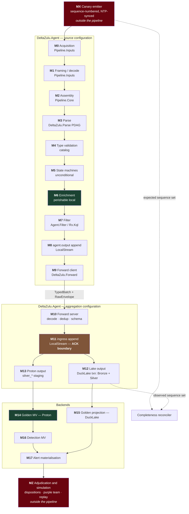
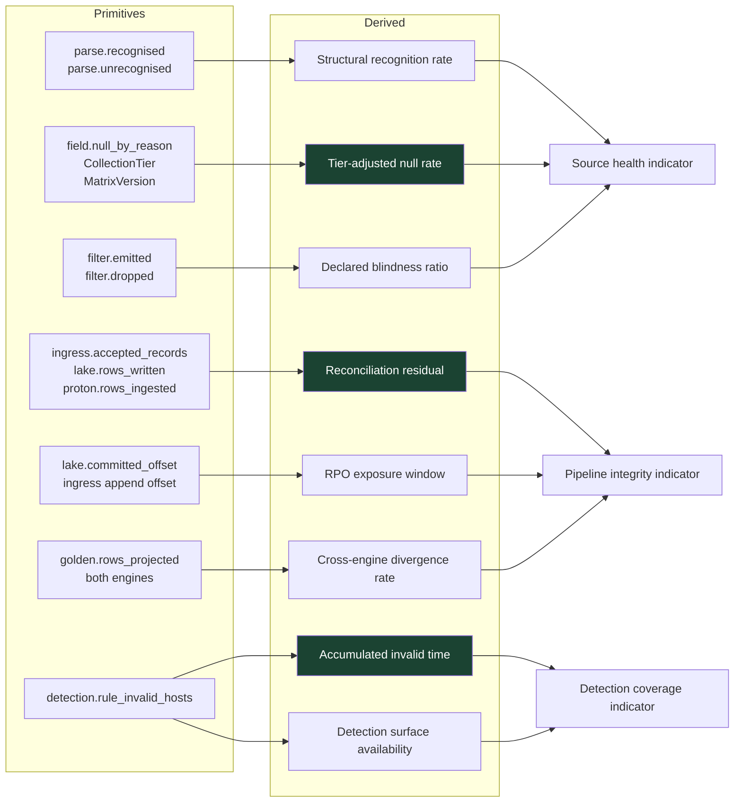

# DeltaZulu Data Quality Monitoring — Metrics, Measurement Points, and Derivations

**Revision:** 16 August 2026 (rev. 2 — incorporates the cross-platform data-quality survey and its thirteen-attribute framework)
**Companion to:** `PIPELINE.md` (15 August 2026)
**Scope:** every quality signal the pipeline emits, the exact component and stage that emits it, what is carried on the record rather than counted, and what is computed from those primitives rather than measured directly.
**Status marking:** each metric is marked **Exists**, **Designed** (specified but not implemented), or **New** (proposed here).

> **Import note.** Imported verbatim on 2026-08-16, unedited, so citations stay
> stable. Corrections and integration decisions live in
> `DATA-QUALITY-MONITORING-INTEGRATION.md` alongside it, not inside this file.

---

## 1. Purpose

A metric is only trustworthy if it is emitted at the point where the information still exists. That single constraint decides most of this document.

`ProcessExited` can be known only inside the agent's enrichment stage, in the moment the `OpenProcess` call fails. Two hops downstream it is an ordinary null, indistinguishable from a field the source never carried. A parser's failure to recognise a line can be known only inside the PDAG walk; by the time the record reaches Silver, an unrecognised line has either been dropped or has become an unremarkable row with fewer columns. A timestamp assigned by fallback is indistinguishable from an observed one the instant it is written, unless the fallback records itself.

Every entry below therefore answers three questions. **What** is measured, **where** it must be measured because nowhere later can know it, and **how** aggregate signals are derived from those primitives rather than collected separately.

Three design rules follow.

**Emit at the point of loss, aggregate later.** No metric is computed at a stage that is merely convenient. If a stage cannot distinguish two causes, it does not emit a metric that pretends to.

**Closed enumerations, never free text.** Every reason code comes from a fixed set. An open reason string becomes an unbounded cardinality key and an unqueryable column within a quarter.

**Versioned interpretation.** Any metric whose meaning depends on a reference artefact — a capability matrix, a normalisation ruleset, a parser generation — carries that artefact's version. Otherwise changing the artefact silently rewrites the meaning of everything already recorded.

**Volume is not loss.** A twenty per cent fall in event rate may mean data loss, a genuine fall in activity, or an intentional filter change. Nothing internal to the pipeline distinguishes those three, because all three look identical from inside. Establishing completeness requires evidence originating outside the pipeline: source-side sequence numbers, producer counters, or injected canaries. This rule is new in rev. 2 and it is the single most significant gap the survey exposed in rev. 1, which measured only internal conservation.

**Absence must be detectable from the receiving side.** A metric reported by a component cannot report that component's own death. `last_record_age` emitted by an agent is silent precisely when the agent stops. Every presence signal therefore needs a receiver-side counterpart computed against an expected-source inventory the sender does not control.

### 1.1 Provenance of rev. 2 changes

The revision draws on a fourteen-platform survey whose thirteen-attribute framework is reproduced in §3.1. Two cautions apply to how its material has been used.

The survey's citations are unresolvable reference tokens rather than URLs, so **no vendor-specific claim in it has been independently verified**, and none is treated as load-bearing here. What has been adopted is the *framework* — the attribute set, the measurement methods, and the structural findings — because those stand on their own reasoning. Where a vendor comparison appears below, it is drawn from the Splunk documentation read directly in the previous review, not from the survey.

The survey's numeric scores should also be read sceptically. Means are reported to two decimal places from integer scores over thirteen attributes with unspecified cells excluded, which is false precision, and excluding unspecified cells rewards documentation gaps — a limitation the survey states and then reports the means anyway. One concrete instance is checkable: the survey scores Splunk 5/5 for pipeline observability, but Splunk's own documentation records that the Data Quality dashboard is derived from splunkd.log, meaning quality visibility is bounded by what a processor happened to log at WARN level. That is a materially weaker property than instrumented counters and the score does not reflect it.

---

## 2. Measurement points

Measurement points are named `M0` through `M17` and referenced by identifier throughout. They follow the Fluent-style topology: the same identifiers apply whether a node is configured as a source, a relay, or an aggregator, so a two-hop deployment simply reports `M0`–`M9` twice with different `AgentId` values.

Two points added in rev. 2 sit **outside** the pipeline and are numbered accordingly. `MX` is the source-side canary emitter, upstream of everything DeltaZulu controls, and is the only origin of true completeness evidence. `MZ` is the external adjudication and simulation channel, downstream of alerting, and is the only origin of recall evidence. Neither can be replaced by an internal metric, which is the point of separating them.



| ID | Stage | Component | Why quality signal must originate here |
|---|---|---|---|
| **MX** | Canary emission | External harness, per source class | **The only origin of completeness evidence.** Nothing inside the pipeline can distinguish loss from a genuine fall in activity |
| M0 | Resource acquisition | `DeltaZulu.Pipeline.Inputs` | Only the reader knows a file rotated, a channel subscription lapsed, or a byte range was skipped |
| M1 | Framing and decode | `DeltaZulu.Pipeline.Inputs` | Truncation and encoding failure are destructive; after this point the bytes are gone |
| M2 | Multi-record assembly | `DeltaZulu.Pipeline.Core` | Only the assembler knows a group never completed or expired |
| M3 | Structural parse | `DeltaZulu.Parse` PDAG | Recognition outcome exists only during the walk |
| M4 | Type validation | type-contract catalogue | Reject-not-coerce failures are visible only at the conversion attempt |
| M5 | State machine update | `DeltaZulu.Pipeline.Core` | Lookup miss and reorder-window expiry are momentary |
| M6 | Perishable enrichment | `DeltaZulu.Pipeline.Enrichment` | `ProcessExited`, `AccessDenied`, `HashFailed` are knowable nowhere else, ever |
| M7 | Filter | `DeltaZulu.Agent.Filter` | Only the filter knows which declared rule discarded a record |
| M8 | `agent.output` append | `DeltaZulu.LocalStream` | Retention eviction before delivery is silent loss and only the log knows |
| M9 | Forward client | `DeltaZulu.Forward` | Retransmit, credit exhaustion and NACK are transport-local |
| M10 | Forward server | `DeltaZulu.Forward` | Decode failure, duplicate suppression, unknown schema fingerprint |
| M11 | Ingress append | `DeltaZulu.LocalStream` | **The durable-acceptance point.** ACK semantics are defined here |
| M12 | Lake output | DuckLake adapter | Bronze and Silver commit atomically; lineage completeness provable here |
| M13 | Proton output | Proton HTTP adapter | Ingest rejection and staging TTL eviction |
| M14 | Golden materialised view | Proton | Enrichment join miss, dimension cold start, late arrival, view lag |
| M15 | Golden projection | DuckLake | Batch counterpart of M14; the equivalence reference |
| M16 | Detection view | Proton | Rule validity per host, match counts, threshold crossings |
| M17 | Alert materialisation | Platform | Idempotency collisions, duplicate absorption |
| **MZ** | Adjudication and simulation | Analyst workflow, purple team, replay harness | **The only origin of recall evidence.** No internal metric can measure an attack that produced no alert |

### 2.1 Transport class governs what completeness can mean

Completeness targets are not comparable across transports, and averaging them across a fleet produces a number that means nothing. Every source is therefore tagged with its transport class, and every completeness metric is reported per class before it is reported in aggregate.

| Transport class | Delivery property | What a completeness figure can claim |
|---|---|---|
| Buffered agent over Forward | At-least-once with ACK on durable append; bounded by `agent.output` retention | Loss is measurable and attributable; a gap means retention was exceeded or the agent died with an uncommitted offset |
| File and journal tail | At-least-once, bounded by offset persistence | A byte gap after restart or rotation is detectable and must be counted |
| Windows channel and ETW | Provider-side buffering with documented drop counters | Provider drops precede the agent and must be read from the provider, not inferred |
| Syslog TCP or RELP | Ordered, no application acknowledgement to the original producer | Loss upstream of the receiving agent is invisible to DeltaZulu |
| **Syslog UDP** | **No delivery guarantee at all** | **A completeness figure is not obtainable.** The source must be marked as unmeasurable rather than reported at an assumed rate |
| API polling | Provider-controlled availability, pagination and rate limits | Gaps may originate at the provider; poll-window continuity must be tracked separately from record counts |

The UDP row matters more than its length suggests. Agent Phase 3 includes a `syslog-udp` adapter. Any dashboard that shows a completeness percentage for a UDP source is presenting a fabricated number, and the correct behaviour is to render it as unmeasurable.

---

## 3. The eight quality planes

Rev. 1 defined six planes. Rev. 2 adds two that the survey's framework makes unavoidable, and both are qualitatively different from the first six because neither can be computed from pipeline telemetry alone.

| Plane | Question | Evidence origin | DeltaZulu's coverage |
|---|---|---|---|
| **Completeness** | Did everything the source produced arrive? | **MX — external** | **Nothing** (new in rev. 2) |
| **Presence** | Is the source sending at all? | M0 plus receiver-side inventory | ADR 0009 taxonomy — Designed |
| **Structure** | Was the record framed, assembled and parsed correctly? | M1–M3 | **Nothing** |
| **Field** | Was each field resolved, and if not, why? | M4–M6 | Null-reason enumeration, tier matrix — Designed |
| **Semantic** | Did the value map onto the canonical model? | M14/M15 | **Nothing** |
| **Timeliness** | Did it arrive in time to be evaluated? | M0…M15 | **Nothing** |
| **Delivery** | Did every accepted record reach durable storage exactly once? | M8–M13 | Partial: Forward dedup window |
| **Durability** | Is retained evidence still retrievable and unaltered? | M12 plus restore harness | **Nothing** (new in rev. 2) |
| **Adjudication** | Did alerts correspond to real activity, and what was missed? | **MZ — external** | **Nothing** (new in rev. 2) |

The two external planes are separated deliberately. Everything from Presence to Durability is a property of the pipeline and can be instrumented inside it. Completeness and Adjudication are properties of the *relationship between the pipeline and the world*, and no amount of internal instrumentation produces them. Conflating the two categories is how a platform comes to report high confidence in telemetry it never received.

### 3.1 Mapping to the survey's thirteen attributes

The survey's attribute set is a reasonable checklist and maps onto the plane model without remainder. The mapping is given so that a procurement conversation conducted in the survey's vocabulary can be answered in DeltaZulu's.

| Survey attribute | Plane | Measurement point | DeltaZulu position |
|---|---|---|---|
| CR — collection reliability | Completeness, Delivery | MX, M0, M8–M12 | Canary path new; internal conservation designed |
| SC — ingestion throughput | Delivery | M11–M13 | Benchmark work, Agent Phase 18 |
| PA — parsing accuracy | Structure | M3 plus golden corpus | Counters new; corpus new |
| SM — schema mapping | Field, Semantic | M4, M14/M15 | Catalogue exists as contracts, unconsumed |
| TF — timestamp fidelity | Timeliness | M3, M6 | `TimestampOrigin` new; decomposition new |
| MP — metadata preservation | Field | M12 | Bronze write-once; lineage completeness designed |
| PO — pipeline observability | All internal planes | M0–M17 | The subject of this document |
| ER — error handling and retry | Delivery | M9–M13 | Forward retransmit and NACK metrics new |
| RI — retention and archival integrity | **Durability** | M12 plus restore harness | **Absent — see §7.1** |
| TC — detection telemetry completeness | Coverage | M16 | Rule validity designed; data contracts new — see §11.1 |
| AF — alert fidelity | **Adjudication** | MZ | **Absent — see §11.2** |
| DL — detection latency | Timeliness | M0…M16 | Decomposition new |
| LN — data lineage | Field, Delivery | M12 | `RecordId` and `RawEventId` designed |

Three attributes had no representation at all in rev. 1: retention integrity, detection data contracts, and alert fidelity. Sections 7.1, 11.1 and 11.2 close them.

---

## 4. Record-carried provenance versus counters

The distinction is not stylistic. It decides whether a question can be answered about a single row a year from now.

**Carry on the record** when the answer must survive to read time for an individual event. **Emit as a counter** when the answer only has to be true in aggregate at operate time. Carrying everything on the record doubles storage and cardinality; counting everything destroys forensic answerability. The split below is deliberate.

### 4.1 Fields carried on every record

| Field | Type | Set at | Status | Why not a counter |
|---|---|---|---|---|
| `RecordId` | string | M0 | Exists | Lineage key joining Bronze, Silver, Golden and the Proton stream |
| `DeliveryId` | string | M9 | Exists | Delivery identity, distinct from event identity |
| `CreatedAt` | datetime | M0 | Exists | Agent-side observation instant, distinct from event time |
| `CollectionTier` | enum `A`\|`B`\|`C`\|`Linux` | M0 | Designed | A null's meaning is tier-dependent; aggregate cannot recover it |
| `TimestampOrigin` | closed enum | M3/M6 | **New** | A fallback-assigned time is indistinguishable from an observed one once written |
| `NullReasons` | sparse map field→enum | M4–M6 | Designed | The core forensic property; irrecoverable downstream |
| `MatrixVersion` | int | M6 | Designed | A row written under matrix v3 must be read under v3 |
| `ParserId` / `ParserVersion` | string / int | M3 | **New** | Attribution of a bad extraction to a generation |
| `ParserGeneration` | int | M3 | Designed | Drift measurement partitions on this |
| `RulebaseHash` | string | M3 | **New** | Detects rulebase divergence across a fleet |
| `ParserLocationAgentId` | string | M3 | **New** | Under the Fluent model, parsing may happen at any hop |
| `FilterBoundaryVersion` | string | M7 | Designed | The declared collection boundary in force when this record passed |
| `OriginAgentId` | string | M0 | **New** | Multi-hop identity and loop detection |
| `HopCount` | int | M9 | **New** | Loop prevention and topology observability |
| `EnrichmentSnapshots` | map source→version | M6/M14 | Designed | Forensics needs what was true at the time, not what is true now |
| `RawEventId` | string | M12 | Designed | Silver-to-Bronze lineage; equals `RecordId` unless reparsed |

### 4.2 The `TimestampOrigin` enumeration

This is the cheapest high-value addition in the document, and it is the one place where Splunk currently implements DeltaZulu's own stated principle better than DeltaZulu does. Splunk's timestamp assignment falls back through several strategies and raises a dashboard issue even when a fallback succeeds.

```text
ParsedFromRecord          the event body carried its own timestamp and it parsed
SourceEnvelope            taken from a transport header, e.g. RFC 5424 TIMESTAMP
SourceMetadata            file mtime, channel-supplied time, API response field
AgentObservation          the agent's own clock at read time — no event time existed
PreviousRecordCarried     inherited from the preceding record after a parse failure
CollectorReceipt          stamped on arrival at an aggregation node
```

Anything other than `ParsedFromRecord` or `SourceEnvelope` means the event time is an estimate, and any detection with a tight time window should be able to see that.

---

## 5. Primary metrics by measurement point

Counter type is `C` counter, `G` gauge, `H` histogram. Cardinality keys are listed because the key set, not the metric count, is what determines cost.

### 5.1 Presence and acquisition — M0

| Metric | Type | Keys | Status | Notes |
|---|---|---|---|---|
| `acquisition.bytes_read` | C | agent, source | Exists | Volume baseline for all ratios |
| `acquisition.records_framed` | C | agent, source | Exists | Denominator for structure-plane ratios |
| `acquisition.resource_open_failures` | C | agent, source, reason | Exists | Permission, missing, locked |
| `acquisition.rotation_detected` | C | agent, source | **New** | Distinguishes rotation from truncation |
| `acquisition.byte_gap` | C | agent, source | **New** | Offset discontinuity after restart or rotation — silent loss |
| `acquisition.last_record_age` | G | agent, source | Designed | The presence-plane signal; a silent source has no other symptom |
| `channel.subscription_state` | G | agent, channel | Designed | Windows channel and ETW session liveness |
| `audit_policy.state` | G | agent, policy | Designed | Feeds the generation-gap taxonomy |

### 5.1a Completeness — MX and receiver-side presence

Every metric in this block is new in rev. 2, and none of it can be produced by the agent alone.

| Metric | Type | Keys | Point | Notes |
|---|---|---|---|---|
| `canary.emitted` | C | source_class, canary_run | MX | Sequence-numbered, NTP-synchronised, emitted at a known rate |
| `canary.observed` | C | source_class, canary_run, stage | M0, M12, M15 | Observed at three stages so loss is attributable, not merely detected |
| `canary.sequence_gaps` | C | source_class, canary_run | reconciler | Missing sequence numbers, not merely a count shortfall |
| `canary.duplicates` | C | source_class, canary_run | reconciler | **Duplication is a distinct defect from loss** and must not be netted against it |
| `canary.clock_error` | H | source_class, agent | reconciler | Absolute error between the canary's emission time and the recorded event time |
| `source.expected_inventory` | G | node, source | receiver | Sources the aggregation node expects to hear from |
| `source.silent_sources` | G | node | receiver | **Receiver-side absence detection.** Does not depend on the silent agent reporting its own silence |
| `source.unexpected_sources` | G | node | receiver | A source sending that no inventory entry covers — a configuration or authorisation finding |

### 5.2 Structure — M1, M2, M3

This entire block is currently absent from DeltaZulu and is the clearest gap the Splunk comparison surfaced. Truncation and incomplete assembly are the two most common ingest defects in any log platform.

| Metric | Type | Keys | Point | Status | Notes |
|---|---|---|---|---|---|
| `framing.truncated_records` | C | agent, source | M1 | **New** | Record exceeded the byte limit; content destroyed here |
| `framing.truncated_bytes_dropped` | C | agent, source | M1 | **New** | Magnitude, not just incidence |
| `framing.encoding_errors` | C | agent, source | M1 | **New** | Invalid UTF-8 replaced or rejected |
| `framing.oversize_records` | H | agent, source | M1 | **New** | Size distribution; the analogue of `len(_raw)` |
| `assembly.groups_completed` | C | agent, source | M2 | **New** | Denominator |
| `assembly.groups_timed_out` | C | agent, source | M2 | **New** | Multi-record event never closed — silent partial event |
| `assembly.groups_evicted` | C | agent, source | M2 | **New** | Bounded state pressure forced eviction |
| `assembly.group_age` | H | agent, source | M2 | **New** | Sizes the reordering window empirically |
| `parse.recognised` | C | agent, source, parser_gen | M3 | Designed | ADR 0009 |
| `parse.unrecognised` | C | agent, source, parser_gen | M3 | Designed | The blindness signal |
| `parse.errors` | C | agent, source, parser_gen, reason | M3 | Designed | Distinct from unrecognised |
| `parse.backtrack_depth` | H | agent, parser_gen | M3 | **New** | PDAG pathology detector, and a cost signal |
| `parse.duration` | H | agent, parser_gen | M3 | Exists | Benchmark input |
| `timestamp.origin` | C | agent, source, origin | M3 | **New** | Aggregate roll-up of the record field |

### 5.3 Type and field resolution — M4, M5, M6

| Metric | Type | Keys | Point | Status | Notes |
|---|---|---|---|---|---|
| `typing.rejections` | C | agent, source, field, kql_type | M4 | Designed | Reject-not-coerce fired; a schema or parser defect |
| `typing.overflow_rejections` | C | agent, source, field | M4 | Designed | e.g. `ulong` above `long.MaxValue` |
| `state.lookup_hits` | C | agent, machine | M5 | **New** | Process table, socket table, session table |
| `state.lookup_misses` | C | agent, machine, reason | M5 | **New** | Not-yet-seen versus expired-from-window |
| `state.reorder_window_expiries` | C | agent, machine | M5 | **New** | **Measures the assumed miss rate the design says must be measured** |
| `state.pid_reuse_detected` | C | agent | M5 | **New** | Linux identity weakness made visible |
| `state.table_size` | G | agent, machine | M5 | **New** | Unbounded-growth guard |
| `enrichment.resolved` | C | agent, class | M6 | Designed | Lineage, session, container, socket owner |
| `enrichment.unresolved` | C | agent, class, reason | M6 | Designed | Reason from the closed null-reason enumeration |
| `field.null_by_reason` | C | agent, tier, field, reason | M6 | Designed | Roll-up of the record's `NullReasons` map |

### 5.4 Declared boundary — M7

| Metric | Type | Keys | Status | Notes |
|---|---|---|---|---|
| `filter.emitted` | C | agent, source, profile, version | Exists | |
| `filter.dropped` | C | agent, source, rule_id, version | Exists | Per rule, not per profile — otherwise the boundary is not auditable |
| `filter.no_candidate` | C | agent, source | Designed | No rule matched at all; distinct from an explicit drop |
| `filter.evaluation_errors` | C | agent, rule_id | Designed | A failing rule is not a passing rule |

### 5.5 Local durability and transport — M8, M9

| Metric | Type | Keys | Point | Status | Notes |
|---|---|---|---|---|---|
| `stream.append_lag` | G | agent, topic, partition | M8 | **New** | |
| `stream.retention_evictions` | C | agent, topic | M8 | **New** | **Eviction before delivery is loss.** Must be distinguishable from normal expiry of delivered records |
| `stream.subscription_lag` | G | agent, topic, subscription | M8 | **New** | |
| `stream.disk_utilisation` | G | agent | M8 | **New** | Threshold input for backpressure policy |
| `forward.batches_sent` | C | agent, peer | M9 | Exists | |
| `forward.batches_acked` | C | agent, peer | M9 | Exists | |
| `forward.retransmits` | C | agent, peer, cause | M9 | **New** | Reconnect versus timeout versus NACK |
| `forward.nacks_received` | C | agent, peer, reason | M9 | **New** | Reframed `DeadLetterForward` |
| `forward.credit_exhausted_duration` | C | agent, peer | M9 | **New** | Backpressure incidence, not just state |
| `forward.session_resets` | C | agent, peer, cause | M9 | **New** | |
| `forward.ack_latency` | H | agent, peer | M9 | **New** | |

### 5.6 Aggregation node — M10, M11, M12, M13

| Metric | Type | Keys | Point | Status | Notes |
|---|---|---|---|---|---|
| `ingress.decode_failures` | C | node, peer, reason | M10 | **New** | Malformed MessagePack, unknown frame |
| `ingress.duplicates_suppressed` | C | node, peer | M10 | Exists | Dedup window hits |
| `ingress.unknown_schema_fingerprints` | C | node, peer | M10 | Exists | Mixed-version fleet signal |
| `ingress.schema_exchange_failures` | C | node, peer | M10 | **New** | The uncorrelatable proactive-push defect surfaces here |
| `ingress.accepted_records` | C | node, source_type | M11 | **New** | **The ACK-boundary count.** Every other downstream count reconciles against this |
| `ingress.append_latency` | H | node | M11 | **New** | Directly bounds ACK latency |
| `lake.txn_commits` | C | node | M12 | **New** | Bronze plus Silver committed atomically |
| `lake.txn_conflicts` | C | node | M12 | **New** | DuckLake concurrent-writer retry pressure |
| `lake.txn_retry_exhausted` | C | node | M12 | **New** | Commit gave up; the failure mode DuckLake documents |
| `lake.rows_written` | C | node, layer, source_family | M12 | **New** | Bronze and Silver separately |
| `lake.committed_offset` | G | node, topic | M12 | **New** | Input to the RPO exposure derivation |
| `proton.rows_ingested` | C | node, stream | M13 | **New** | |
| `proton.ingest_rejections` | C | node, stream, reason | M13 | **New** | |
| `proton.committed_offset` | G | node, topic | M13 | **New** | |
| `proton.staging_ttl_evictions` | C | node, stream | M13 | **New** | Staging expired before the Golden view consumed it |

### 5.7 Semantic projection and detection — M14, M15, M16, M17

| Metric | Type | Keys | Point | Status | Notes |
|---|---|---|---|---|---|
| `golden.rows_projected` | C | engine, activity, source_family | M14/M15 | **New** | Emitted identically by both engines; equivalence depends on it |
| `golden.unmapped_family_events` | C | engine, source_family | M14/M15 | Designed | **Silver rows with no Golden mapping produce no nulls to notice** |
| `golden.enum_mismatches` | C | engine, field, value_hash | M14/M15 | **New** | The UBA plane; value is hashed to bound cardinality |
| `golden.enum_mismatch_top_values` | G | engine, field | M14/M15 | **New** | Bounded top-N literal values retained — what makes the metric actionable |
| `golden.enrichment_join_misses` | C | engine, dimension, reason | M14/M15 | **New** | `NotFound` versus `DimensionNotReady` must not share a code |
| `golden.dimension_ready` | G | engine, dimension | M14 | **New** | Cold-start guard; a not-ready join is not a miss |
| `golden.late_arrival_excluded` | C | activity, window | M14 | **New** | **Event fell outside the detection window and was never evaluated** |
| `golden.view_lag` | G | activity | M14 | **New** | A stalled Golden view is a detection-surface outage |
| `golden.view_state_bytes` | G | activity | M14 | **New** | Join-buffer pressure against the configured cap |
| `detection.rule_valid_hosts` | G | rule_id | M16 | Designed | From the tier×field matrix |
| `detection.rule_invalid_hosts` | G | rule_id, missing_field | M16 | Designed | The differentiating signal |
| `detection.matches` | C | rule_id | M16 | Exists | |
| `detection.threshold_crossings` | C | rule_id | M16 | Designed | Windowed, per the KQL-embedded threshold |
| `alert.materialisations` | C | rule_id | M17 | Exists | |
| `alert.idempotency_collisions` | C | rule_id | M17 | Designed | Duplicates absorbed rather than prevented |

### 5.8 Durability — M12 plus restore harness

All new in rev. 2. Retention duration is a configuration setting, not a control; nothing in the current design demonstrates that a payload written eleven months ago is still retrievable and unaltered.

| Metric | Type | Keys | Notes |
|---|---|---|---|
| `bronze.payload_digest_written` | C | node, day partition | Digest computed at M12 and stored beside the payload |
| `bronze.digest_verification_runs` | C | partition | Scheduled re-read and re-hash of a sample |
| `bronze.digest_mismatches` | C | partition | **Any non-zero value is an integrity incident**, not a quality metric |
| `archive.restore_tests` | C | partition age band | Scheduled restore from the oldest retained partition, not the newest |
| `archive.restore_failures` | C | partition, reason | Missing file, catalogue mismatch, unreadable Parquet |
| `archive.restore_duration` | H | partition age band | The measured RTO, distinct from the stated one |
| `archive.completeness` | G | partition | Files the DuckLake catalogue references, over files actually present |
| `retention.policy_shortfall` | G | source_family | Configured retention below the family's required retention — a compliance control, not an operations one |

### 5.9 Adjudication — MZ

All new in rev. 2, and all sourced from outside the pipeline. These are recorded here because they must join to pipeline metrics on `RuleId` and `RecordId`, not because DeltaZulu produces them.

| Metric | Type | Keys | Notes |
|---|---|---|---|
| `alert.dispositions` | C | rule_id, disposition | True positive, false positive, benign true positive, undetermined |
| `alert.disposition_coverage` | G | rule_id | Alerts adjudicated over alerts raised — **precision is meaningless below high coverage** |
| `simulation.techniques_executed` | C | technique_id, run | Purple-team or replay ground truth |
| `simulation.techniques_detected` | C | technique_id, run | Joined to `RuleId` and to the `RecordId` that produced the alert |
| `simulation.telemetry_present_not_detected` | C | technique_id | **The most valuable single counter in this document.** The event reached Golden and no rule fired — a content gap, not a collection gap |
| `simulation.telemetry_absent` | C | technique_id, missing_source | The event never arrived — a collection gap, not a content gap |

---

## 6. Derived metrics

Derived metrics are computed from the primitives above and are where operational meaning lives. Each names its inputs, the component that computes it, and the window over which it is valid.



### 6.0 Completeness plane — external ground truth

| Derived metric | Definition | Computed at | Window | Purpose |
|---|---|---|---|---|
| **Canary completeness** | `distinct canary sequences observed / canary sequences emitted`, per source class and stage | Reconciler | 15 min | **The only figure that can honestly be called completeness.** Reported per stage so a shortfall is attributable to acquisition, transport or lake |
| **Canary duplication rate** | `canary observations − distinct sequences observed`, over distinct sequences | Reconciler | 15 min | Duplication and loss are independent defects; netting them hides both |
| **Sequence-gap incidence** | Missing sequence runs per hour, with run length | Reconciler | 1 h | A single long gap and many short gaps have different causes |
| **Clock error distribution** | Absolute error between canary emission time and recorded event time | Reconciler | 1 h | Detects timezone, DST and skew defects that no count-based metric reveals |
| **Unmeasurable source ratio** | Sources on transports with no completeness guarantee, over total sources | Platform Analytics | 24 h | **Makes the limit of the completeness claim itself a reported number** rather than an unstated caveat |

### 6.1 Structure plane

| Derived metric | Definition | Computed at | Window | Purpose |
|---|---|---|---|---|
| **Structural recognition rate** | `recognised / (recognised + unrecognised + errors)`, partitioned by source and parser generation | Platform Analytics | 1 h | The blindness headline. Partitioning by generation is what makes a regression attributable |
| **Field-level parse precision and recall** | Against a labelled golden corpus per source: correctly extracted fields over extracted fields, and over fields present in the labelled record | CI, per build | Per build | **Drift measures self-consistency; this measures correctness.** A parser wrong since day one has zero drift and poor recall |
| **Parser regression rate** | Golden-corpus cases passing before a change and failing after | CI | Per build | Gate on parser, rulebase and content updates |
| **Truncation incidence** | `truncated_records / records_framed` | Platform Analytics | 1 h | Splunk's most common ingest defect; a rising value means a limit needs raising or framing is wrong |
| **Assembly completion rate** | `groups_completed / (completed + timed_out + evicted)` | Platform Analytics | 1 h | Partial multi-record events are silently wrong, not absent |
| **Parser drift rate** | Disagreement between agent extraction and a server reparse of the same Bronze payload, over a ~1% stratified sample | Platform, batch job over DuckLake | 24 h | The only signal that a parser is producing *plausible but wrong* values. Stratified, because uniform sampling never reaches rare formats |
| **Rulebase divergence** | Distinct `RulebaseHash` values per `ParserId` across the fleet | Platform Analytics | 1 h | Detects partial rollout and stale relays |

### 6.2 Field plane — the discriminating derivations

| Derived metric | Definition | Computed at | Window | Purpose |
|---|---|---|---|---|
| **Field resolution rate** | `1 − (nulls for field / rows where field is expected at tier)` | M15, over Golden | 1 h | Per field, per tier |
| **Tier-adjusted null rate** | Nulls *excluding* `NotAvailableAtTier`, divided by rows where the matrix says the field **is** available | M15 | 1 h | **The central derivation.** Separates *cannot supply* from *should have supplied and did not*. An untier-adjusted null rate conflates a Tier C host behaving correctly with a Tier A host failing |
| **Unexplained null rate** | Nulls carrying no reason code, over total nulls | M15 | 1 h | **An audit of the accounting itself.** A non-zero value means a write path bypassed provenance. Should be zero by construction; alarm on any nonzero |
| **Enrichment failure rate** | `enrichment.unresolved / (resolved + unresolved)` per class | M6 roll-up | 1 h | Separated by class, because CMDB failure and process-exit are unrelated problems |
| **Provenance completeness** | Rows carrying all mandatory provenance fields, over total rows | M12 | 24 h | Catches a producer shipping records without tier or matrix version |

### 6.3 Semantic plane

| Derived metric | Definition | Computed at | Window | Purpose |
|---|---|---|---|---|
| **Enum mismatch ratio** | `enum_mismatches / rows_projected`, per field | M14/M15 | 1 h | Directly modelled on UBA's ratio. Suggested initial thresholds: warn 0.05, bad 0.15 — tighter than UBA's 0.1/0.2, because DeltaZulu computes per field rather than per data source |
| **Unmapped family ratio** | `unmapped_family_events / silver rows for that family` | M15 | 1 h | A family with no Golden mapping produces zero rows and zero nulls. Nothing else catches it |
| **Golden reproducibility** | Sample of Bronze payloads replayed through the current projection, compared to stored Golden | Platform batch | 7 d | Proves the architectural rule that every Silver and Golden row is reproducible from retained evidence plus versioned definitions |
| **Cross-engine divergence rate** | Rows differing between the DuckLake and Proton Golden projections of the same fixture, including null and reason equality | CI plus a production sample | Per build, plus 24 h | **Without this, dual-compiled Golden is two implementations wearing one name** |

### 6.4 Timeliness plane

| Derived metric | Definition | Computed at | Window | Purpose |
|---|---|---|---|---|
| **Ingest latency** | `lake commit time − event time`, decomposed per stage | M12 | 5 min | Splunk's `_indextime − _time`, decomposed rather than aggregate |
| **Latency decomposition** | Acquisition age, agent queue, transport, ingress queue, lake commit, Golden projection | M0…M15 | 5 min | Attribution, so a latency alarm names a component |
| **Late-arrival exclusion rate** | `late_arrival_excluded / rows_projected` per activity | M14 | 1 h | **A silent detection miss with no null to notice.** An event outside the tumble is never evaluated and nothing errors |
| **Detection surface availability** | `1 − (Golden view stall seconds / period)` | M14 | 24 h | A stalled Golden view is an outage of every detection, and must be reported as one |

### 6.5 Delivery plane

| Derived metric | Definition | Computed at | Window | Purpose |
|---|---|---|---|---|
| **Reconciliation residual** | See §7 | Every stage | 5 min | The accounting's own integrity check |
| **Delivery amplification** | `lake.rows_written / ingress.accepted_records` | M12 | 1 h | Above 1.0 means duplicates escaped the dedup window; below 1.0 means loss |
| **RPO exposure window** | `ingress append offset − lake.committed_offset`, expressed in records **and** seconds | M11 versus M12 | Continuous gauge | **The acknowledged-but-not-persisted window.** Documenting an RPO without exposing the live window is the durability version of letting an unknown read as a known |
| **Sink divergence** | `lake.committed_offset − proton.committed_offset` | M12 versus M13 | Continuous | The two sinks advance independently by design; any interface reporting "events ingested" must state which leg it counts |
| **Effective retention horizon** | Oldest offset retained, per stream, versus the longest configured detection window | M8, M11, M13 | 15 min | Determines how far back newly deployed content can backfill |

### 6.6 Coverage plane

| Derived metric | Definition | Computed at | Window | Purpose |
|---|---|---|---|---|
| **Declared blindness ratio** | `filter.dropped / (emitted + dropped)`, keyed by `FilterBoundaryVersion` | Platform Analytics | 1 h | Dropping is legitimate; undeclared dropping is not. Keying on the boundary version is what makes it a statement rather than a number |
| **Rule validity coverage** | Hosts where a rule is valid, over hosts in the rule's scope | M16 | 15 min | Distinguishes *invalid here* from *valid and not matching* |
| **Accumulated invalid time** | Integral over time of rule-invalid host-hours, attributed to collection tier or to a specific missing field | Platform Analytics | 30 d | The headline coverage metric. Attribution is what turns it into a remediation queue |
| **Source silence** | Receiver-side: expected inventory entries with no arrivals within the source's expected interval | Aggregation node | Continuous | Computed at the receiver, because an agent that has stopped cannot report that it has stopped |
| **Data-contract satisfaction** | Detections whose every prerequisite source, field and freshness bound is met, over enabled detections | M16 | 15 min | See §11.1; freshness is a prerequisite, not a separate concern |

### 6.7 Durability plane

| Derived metric | Definition | Computed at | Window | Purpose |
|---|---|---|---|---|
| **Archive integrity rate** | `1 − (digest mismatches / verified payloads)` | Verification job | 7 d | Alarm on any non-zero mismatch |
| **Restore success rate** | Successful restores over attempted, by partition age band | Restore harness | 30 d | **Oldest partition first.** Restoring yesterday proves nothing about eleven months ago |
| **Measured RTO** | p95 restore duration by age band | Restore harness | 30 d | The stated RTO is a policy; this is the fact |
| **Retention shortfall exposure** | Source families whose configured retention is below their required retention | Platform Analytics | 24 h | Catches a lifecycle policy silently shortening a regulated retention period |

### 6.8 Adjudication plane

These derivations are the reason the plane is separated. Every one of them requires evidence DeltaZulu does not generate, and presenting any of them as a pipeline metric would be the category error the survey identifies across the whole market.

| Derived metric | Definition | Computed at | Window | Purpose |
|---|---|---|---|---|
| **Precision** | `TP / (TP + FP)` from analyst dispositions, per rule and per source | Platform, from MZ | 30 d | Report alongside disposition coverage or not at all |
| **Recall estimate** | `TP / (TP + FN)` against simulation ground truth only | Platform, from MZ | Per campaign | **Never inferred from alert volume.** A falling alert count is equally consistent with better tuning and with lost telemetry |
| **Miss attribution split** | `telemetry_present_not_detected` versus `telemetry_absent`, per technique | Platform, from MZ | Per campaign | **Separates a content gap from a collection gap.** This is the join between detection engineering and this document, and it is the whole argument |
| **Coverage honesty ratio** | Techniques claimed as covered by content mapping, over techniques whose prerequisites are currently satisfied *and* which a simulation actually detected | Platform | Per campaign | An ATT&CK mapping is an inventory, not a working control |

---

## 7. Reconciliation: the accounting must itself be auditable

Every stage satisfies a conservation identity. The residual is emitted as a metric, and a non-zero residual means the instrumentation is wrong — which is a more serious condition than any individual quality defect, because every other number becomes untrustworthy.

```text
in = out + dropped + failed + buffered + residual
```

| Stage | `in` | `out` | `dropped` | `failed` | `buffered` |
|---|---|---|---|---|---|
| M1→M3 | `records_framed` | `parse.recognised` | — | `parse.errors` + `parse.unrecognised` | `assembly` open groups |
| M3→M7 | `parse.recognised` | `filter.emitted` | `filter.dropped` | `typing.rejections` | — |
| M7→M9 | `filter.emitted` | `forward.batches_acked` × batch size | `stream.retention_evictions` | `forward.nacks_received` | `agent.output` lag |
| M10→M12 | `ingress.accepted_records` | `lake.rows_written` (Silver) | — | `lake.txn_retry_exhausted` | ingress lag |
| M12→M15 | Silver rows | `golden.rows_projected` | `golden.unmapped_family_events` | projection errors | — |

Two notes. Duplicates make the M10→M12 identity an inequality unless `ingress.duplicates_suppressed` is added to the left-hand side, so the dedup count is part of the identity rather than a side metric. And the M7→M9 row is the one where a silent loss can hide: retention eviction of undelivered records is a *drop*, not a buffer, and must be counted as such.

---

### 7.1 Durability: what the design currently lacks

Bronze is described throughout the architecture as retained evidence for compliance and replay. Nothing in the design demonstrates that the evidence is still what was written.

The survey's clearest cross-market finding is that a handful of platforms treat this as a control rather than a setting: QRadar hashes event and flow logs, Wazuh compresses and digitally signs archives, CrowdStrike documents segment checksums and immutability, and Splunk supports index integrity checking with frozen-data archival. DeltaZulu writes Parquet through a DuckLake catalogue and has none of it. Parquet carries per-page CRCs, which detect corruption but do not detect deliberate modification, and the catalogue database is itself unprotected.

Three controls close the gap, in ascending cost.

A **payload digest** computed at M12 and stored beside the Bronze record makes silent alteration detectable at read time and costs one hash per record. A **partition manifest**, signed per day partition and covering the file list and their digests, extends that to detecting deletion — which a per-record digest cannot, since a removed record leaves no digest behind. And **scheduled restore testing against the oldest retained partition** is the only control that establishes the retention claim is true; a policy configuration asserting twelve months does not demonstrate that an incident from eleven months ago can be reconstructed.

For a regulated payments deployment the second and third are not optional, and the third is the one most often skipped because it is operational rather than architectural.

---

### 7.2 Observability independence

Rev. 1 stated that metrics follow the same path as telemetry, and justified it on the grounds that the metrics pipeline then inherits the durability and provenance properties of the data pipeline. That reasoning holds, but it is incomplete, and the survey names the failure directly: a degraded pipeline should not be the only thing reporting its own degradation.

The concrete failure is narrow and worth stating precisely. Coverage records travel over Forward as ordinary records. A Forward outage therefore suppresses the evidence of the Forward outage, and an agent that dies stops emitting the `last_record_age` that would have shown it died. Every *positive* signal in this document is safe under this model; every *absence* signal is not.

The resolution is not a second metrics pipeline, which would double the owned surface for a partial gain. It is three narrower properties.

**Absence is computed at the receiver.** `source.silent_sources` is derived from an expected-source inventory held at the aggregation node and compared against arrivals. It requires nothing from the silent party. This is why the metric is listed at the receiver in §5.1a rather than at M0.

**A minimal heartbeat is separable from the data path.** The agent already has a control-plane channel — enrolment, heartbeat, policy bundle, acknowledgement — that is independent of Forward. A heartbeat carrying nothing but agent liveness and the current `agent.output` depth survives a Forward outage and is orders of magnitude smaller than the coverage record it does not replace.

**The canary path is external by construction.** MX emits outside the pipeline and the reconciler compares against what the lake actually holds, so a total pipeline failure shows up as a completeness collapse rather than as silence.

With those three, the shared-path design keeps its advantages and loses its blind spot. Without them, an outage looks like a quiet night.

---

## 8. Cardinality budget

Cost is driven by key sets, not by metric count. Four keys are unbounded in principle and must be constrained explicitly.

| Key | Growth | Constraint |
|---|---|---|
| `AgentId` | Fleet size | Per-agent counters aggregate at the receiver; the agent reports its own, the fleet roll-up never keys on both agent and field |
| `FieldName` | Schema size | **Field-level counters exist only at M12 and later.** The agent carries per-field reasons on the record as a sparse map, and emits no per-field counters |
| `RuleId` | Content library size | Rule-keyed metrics live at M16 and M17 only |
| `value_hash` for enum mismatch | Unbounded | Hashed, plus a separately bounded top-N literal retention per field, capped at 50 following UBA's default |

The governing rule: **per-field precision belongs on the record, per-field aggregation belongs at the aggregation node.** Emitting per-field counters from every agent multiplies fleet size by schema width and is the single most likely way this design becomes unaffordable.

---

## 9. Where metrics live

| Store | Contents | Retention |
|---|---|---|
| Agent SQLite metrics state | M0–M9 counters, current values and short history | Hours; source of truth is the coverage record |
| Coverage records over Forward | Periodic snapshot of M0–M9, plus source health, filter summary, audit-policy and channel state | Delivered as ordinary records |
| DuckLake `ops.` schema | All stage counters from every node, plus derived metric outputs | Same as evidence retention |
| Proton `ops_*` streams | M13–M16 live gauges for alarming | Detection window |
| Golden columns | Record-carried provenance from §4.1 | Evidence retention |
| Control-plane heartbeat | Agent liveness and `agent.output` depth only | Transient; independent of Forward |
| Reconciler store | Canary expected and observed sets, per run | 90 d |
| Adjudication store | Dispositions and simulation outcomes joined on `RuleId` and `RecordId` | Case-management retention |

Metrics travel as telemetry, so the metrics path inherits the durability and provenance properties of the data pipeline. The three exceptions in §7.2 exist because that inheritance is exactly wrong for absence signals: the control-plane heartbeat, the receiver-side inventory and the external canary path are the only components that must keep working when the data path does not.

---

## 10. Health indicators

Per-record precision without a roll-up is not operable. Five indicators, each computed from the derivations above, with initial thresholds to be tuned per source family rather than treated as constants.

| Indicator | Inputs | Warn | Bad |
|---|---|---|---|
| **Source health** | Structural recognition rate, truncation incidence, assembly completion, receiver-side silence | recognition < 0.95, or silence > 2× expected interval | recognition < 0.85, or silence > 6× |
| **Completeness** | Canary completeness, duplication rate, sequence-gap incidence, clock error | completeness < 0.999, or any duplication | completeness < 0.99, or p95 clock error > 5 s |
| **Pipeline integrity** | Reconciliation residual, unexplained null rate, delivery amplification, cross-engine divergence, RPO exposure | residual > 0, amplification outside 0.999–1.001 | unexplained nulls > 0, or divergence > 0 |
| **Durability** | Archive integrity rate, restore success, retention shortfall | any restore failure, or measured RTO above target | any digest mismatch, or any retention shortfall |
| **Detection coverage** | Data-contract satisfaction, rule validity, accumulated invalid time, late-arrival exclusion, detection surface availability | contract satisfaction < 0.95, or availability < 0.999 | satisfaction < 0.80, or any Golden view stall > 60 s |

Two notes on severity. Pipeline integrity and durability are deliberately harsh: a non-zero reconciliation residual, an unexplained null, a cross-engine divergence and a digest mismatch each mean a correctness invariant is broken, and none is tolerable in steady state. And **adjudication has no indicator by design.** Precision and recall move on the timescale of a purple-team campaign, not an alert queue, and rendering them as a live health light would invite exactly the inference the survey warns against — reading a falling alert count as improved tuning when it is lost telemetry.

**Tier-zero sources.** Health indicators should not be uniform across sources. Sources whose absence invalidates a high-impact detection — identity authentication, privileged endpoint process telemetry, critical cloud audit trails, key network vantage points — warrant an operational incident rather than a dashboard warning, and their thresholds should be set from the data contracts in §11.1 rather than from a global default.

---

## 11. Detection data contracts and fidelity

### 11.1 The data contract

Rev. 1 derived rule validity from the tier×field matrix, which answers whether a host *can* supply a rule's inputs. It does not answer whether the host is supplying them *now*, or *recently enough*. The survey's framing of a machine-readable dependency contract closes that, and the addition of a freshness bound is the part that was missing.

A contract is authored alongside the detection and is version-controlled with it.

```yaml
rule: suspicious-parent-child-process
requires:
  sources:
    - windows-process-creation
  fields:
    - ProcessName
    - ParentProcessName
    - CommandLine
    - ProcessKey
  min_collection_tier: B
  max_data_age: 60s
  min_field_completeness: 0.99
```

Four consequences follow. The rule's health degrades when any prerequisite falls below its bound, independently of whether the query itself continues to execute without error — which is the distinction between a rule that runs and a rule that works. `max_data_age` makes the late-arrival exclusion metric actionable, because lateness now has a per-rule threshold rather than a global one. `min_collection_tier` connects the contract to the capability matrix, so tier is enforced rather than merely recorded. And the contract is portable: it is DeltaZulu's artefact, not a vendor's dashboard, which matters if content is ever authored against more than one platform.

The derived metric is data-contract satisfaction in §6.6. The acceptance test is to remove one required field from one source without disabling the rule, and verify that the rule reports degraded rather than healthy.

### 11.2 Alert fidelity, and what DeltaZulu should not claim

The survey's central finding is that no reviewed platform natively measures false negatives, and that alert counts, dispositions, tuning history and ATT&CK mappings are all consistent with poor recall. That finding is worth accepting rather than competing with.

DeltaZulu's honest position has three parts.

It **can** measure precision, given analyst dispositions and a coverage figure alongside them. It **cannot** measure recall from anything in this document, and no roll-up of pipeline metrics produces one. And it **can do something the surveyed platforms cannot**, which is split a miss into its two causes.

That split is the argument. When a simulated technique produces no alert, the question is whether the telemetry arrived and no rule matched, or whether the telemetry never arrived. Every other platform in the survey answers "no alert" and stops. With `RecordId` lineage, `CollectionTier`, null reasons and the capability matrix, DeltaZulu can distinguish a **content gap** from a **collection gap** — and, in the collection case, name the field and the reason it was absent.

That is a narrower claim than "we measure false negatives", and it is defensible, which the broader claim would not be.

---

## 12. Implementation sequencing

| Wave | Items | Rationale |
|---|---|---|
| **1 — irreversible** | `CollectionTier`, `TimestampOrigin`, `NullReasons`, `MatrixVersion`, parser provenance, `OriginAgentId`, `HopCount` on the record | Contract fields now, contract revisions later. Cannot be backfilled |
| **2 — structural counters** | M1 framing, M2 assembly, M3 parse outcome | The entire plane is currently absent, and Phase 8 auditd assembly will hit it immediately |
| **2a — external ground truth** | Canary emitter, reconciler, receiver-side source inventory | **Independent of everything else.** Buildable today against the existing NDJSON path and immediately useful; the only thing that makes "completeness" an honest word |
| **3 — reconciliation** | Stage identities and residual emission | Makes every other number auditable; cheap once the counters exist |
| **3a — durability** | Bronze payload digests, signed partition manifests, restore harness | Digests must be written at M12 from the start; a payload written without one cannot be given one later |
| **4 — delivery** | M10–M13 offsets, RPO exposure gauge, delivery amplification | Follows the durable-acceptance decision |
| **5 — semantic** | Enum mismatch with top-N, unmapped family, cross-engine divergence | Requires Golden to exist in both engines |
| **6 — timeliness** | Latency decomposition, late-arrival exclusion, view lag | Requires the Golden materialised view |
| **7 — coverage** | Data contracts, rule validity, accumulated invalid time, declared blindness | The product-facing layer; depends on waves 1 and 5 |
| **8 — adjudication** | Disposition capture, simulation harness, miss attribution split | Last, because it is worthless without waves 1 and 7 supplying the attribution |

Two items move earlier than their apparent priority suggests. **Wave 2a** has no dependencies on the type catalogue, the transport or Golden, so it can be built now and will keep working through every subsequent change; it is also the cheapest way to discover whether current loss rates are what anyone assumes. **Wave 3a** joins wave 1 in the irreversible category for the same reason — a digest is computed at write time or not at all.

---

## 13. Self-assessment against the survey's rubric

Scored on the survey's scale, restricted to what is implemented rather than designed, because a specification is not an instrument. This is the position a prospective customer's acceptance test would find today.

| Attribute | Implemented | With this document delivered | Note |
|---|---:|---:|---|
| CR — collection reliability | 2 | 4 | Forward ACK semantics are strong; completeness evidence absent until wave 2a. Never 5 while UDP sources exist |
| SC — throughput | 1 | 3 | Unbenchmarked; Agent Phase 18 |
| PA — parsing accuracy | 2 | 4 | KQL typing at extraction is ahead of the market; corpus and field-level recall absent |
| SM — schema mapping | 2 | 4 | Catalogue exists as unconsumed contracts with the defects recorded in the architecture document |
| TF — timestamp fidelity | 1 | 5 | `TimestampOrigin` plus decomposition would exceed everything in the survey |
| MP — metadata preservation | 3 | 5 | Bronze write-once with raw plus fields is already a strong position |
| PO — pipeline observability | 2 | 5 | The subject of this document |
| ER — error handling and retry | 3 | 4 | Forward credit windows and NACK are real; durable idempotency still open |
| RI — retention integrity | **1** | 4 | Retention configured, integrity absent. §7.1 |
| TC — detection completeness | 2 | 5 | The capability matrix has no equivalent in the survey |
| AF — alert fidelity | **1** | 3 | Ceiling is 3 by construction; recall needs external ground truth. §11.2 |
| DL — detection latency | 1 | 4 | Decomposition rather than an opaque figure |
| LN — lineage | 2 | 5 | `RecordId` to Bronze payload, with parser and transform versions |

The unweighted mean moves from roughly 1.8 to roughly 4.2 — which is worth stating plainly as **the distance between a design and a product**, not as an achievement. The two attributes that cannot reach 5 by any amount of engineering are alert fidelity, which is bounded by external ground truth, and collection reliability, which is bounded by the transports customers insist on using.

---

## 14. Open questions

Canary injection has no obvious mechanism for several source classes. A file tail accepts an appended line and a syslog listener accepts a datagram, but injecting a sequence-numbered canary into a Windows Security channel or an ETW session without polluting the evidence lake is unresolved, and the fallback — reading the provider's own drop counters instead — measures something weaker.

Whether canaries are filtered out of Bronze or retained and marked is a real decision with no obviously correct answer: retaining them keeps the evidence lake honest about what it contains, and filtering them keeps synthetic records out of forensic search results.

The expected-interval model behind source silence is unspecified: a per-source learned baseline is more accurate than a configured interval but introduces a training period during which the metric is untrustworthy, and that period must be visible rather than assumed.

Whether the stratified reparse sample runs continuously at roughly one per cent or in scheduled batches is undecided, and the two have different cost profiles at the aggregation node rather than at the endpoint.

Late-arrival exclusion presumes windowed detection aggregates. If detection content turns out to be predominantly stateless filters, that metric drops from a correctness signal to an operational nicety, and the decision on threshold placement inside the KQL determines which.

Enum mismatch thresholds are proposed at 0.05 and 0.15 by analogy with UBA's 0.1 and 0.2, adjusted for per-field rather than per-source computation. They are a starting point with no empirical basis in this environment, and should be revised against the first month of real data rather than defended.

Partition-manifest signing needs a key custody model that a managed-service operator can hold without being able to forge a manifest, and the obvious answers all involve either customer-held keys with a support burden or operator-held keys with a weaker assurance claim. This is a commercial decision as much as a technical one.

Simulation cadence is undecided, and it determines whether the miss-attribution split is a quarterly report or an operational signal. Continuous low-rate simulation gives a live figure but risks alert fatigue and contaminating precision measurement; campaign-based simulation is cleaner but produces a number that is stale for most of its life.
