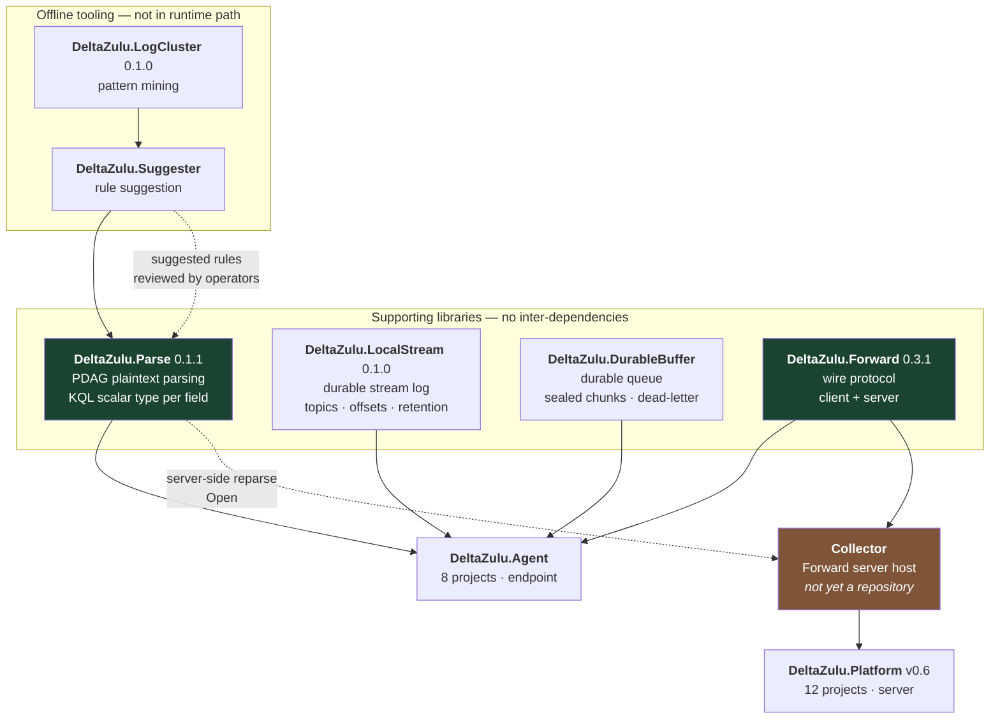
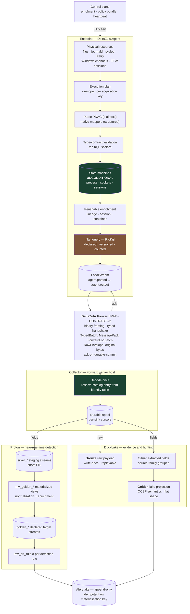
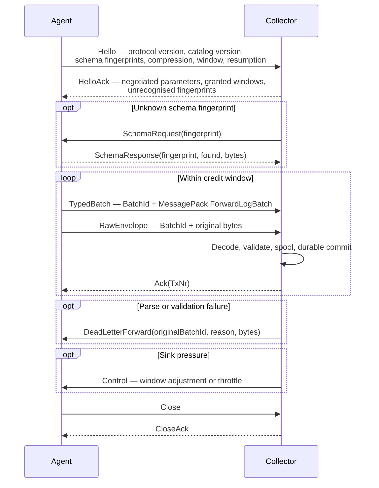
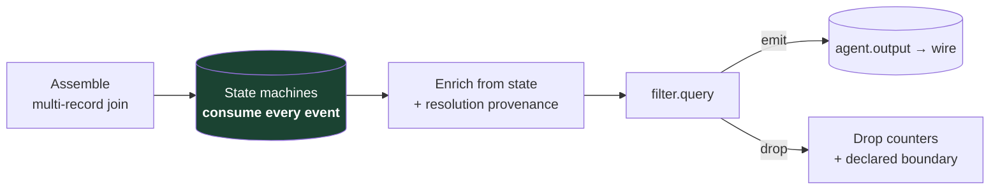
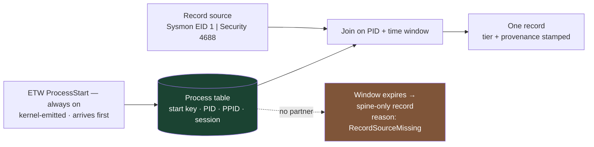
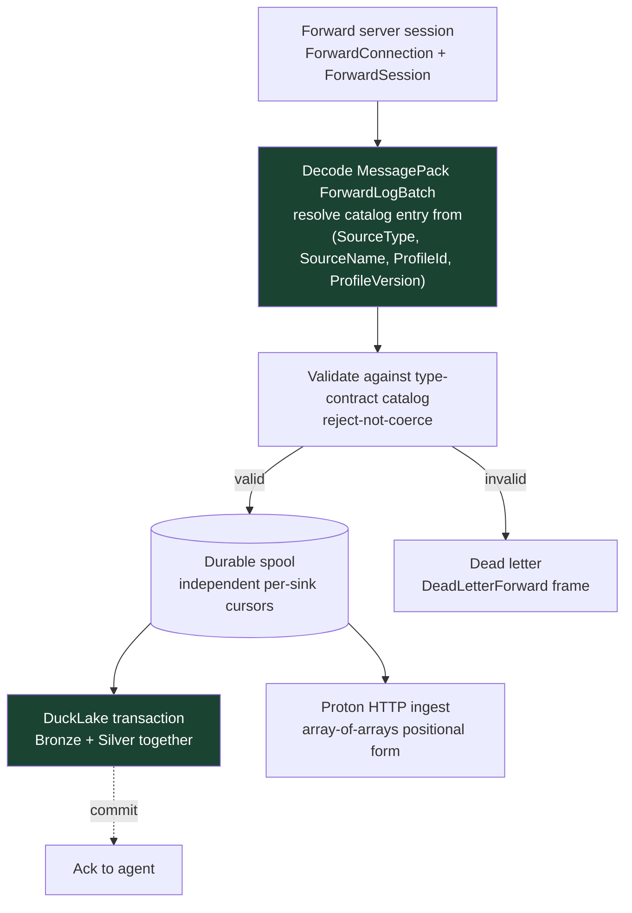
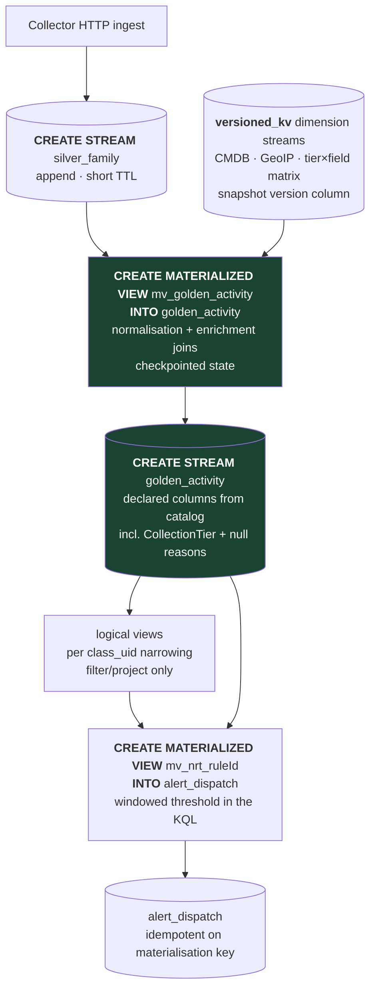
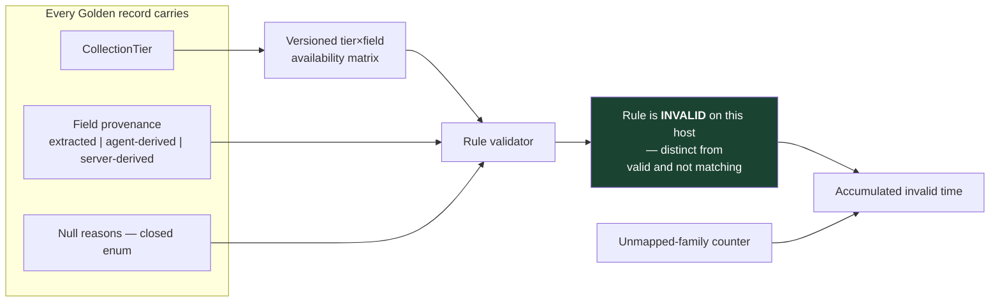
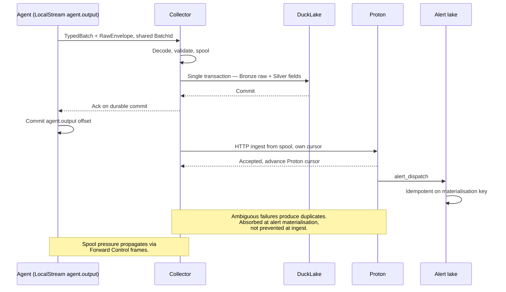
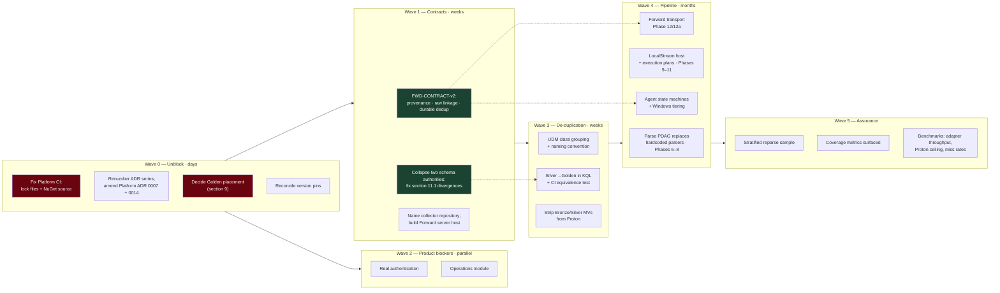

# DeltaZulu Data Pipeline — Consolidated Architecture Across All Repositories

**Revision:** 15 August 2026
**Scope:** the seven `DeltaZulu.*` repositories, the components they contain, the contracts between them, and the end-to-end data flow from endpoint acquisition to alert materialisation.
**Supersedes:** the 12 August 2026 pipeline document, which was written from the `DeltaZulu.Agent` perspective and did not account for the Platform's ingestion decisions or the four supporting libraries.
**Status marking:** every decision below is marked **Settled**, **Proposed**, or **Open**. Nothing is presented as agreed that is not.

---

## 1. Purpose

DeltaZulu OÜ is building a managed SIEM. Seven independently versioned repositories implement it: one endpoint agent, one server application, one transport, and four supporting libraries. The engineering problem is not "build a SIEM" but the narrower question of where and how many times heterogeneous security telemetry is reduced to a queryable common shape, and what is recorded about what was lost in the reduction.

Three questions decide the architecture.

**Where does the reduction happen?** Answer it wrongly and data quality becomes a function of fleet deployment schedule. A parser bug fixed today cannot correct data collected yesterday, and correctness is bounded by the slowest-updating endpoint.

**How many times does it happen?** Answer it wrongly and two engines silently disagree about the same event, producing detections that fire in production and cannot be reproduced during investigation.

**What is recorded about what was lost?** Answer it wrongly and the platform reports what it collected while remaining silent about what it could not. This failure is invisible by construction: a detection rule referencing a field the host cannot supply does not error, it simply never fires, and the empty dashboard reads as safety.

This document consolidates the answers, names the component that owns each, and records where the repositories currently disagree.

---

## 2. Repository inventory

| Repository | Version | Role | Depends on | Implementation state |
|---|---|---|---|---|
| `DeltaZulu.Parse` | 0.1.1 | PDAG plaintext parser; C# port of liblognorm v2. Attaches a KQL scalar type to every extracted field | none | Library complete; 374 upstream parity cases pass |
| `DeltaZulu.Forward` | 0.3.1 | Agent-to-collector wire protocol and reference library. Both client and server sides | MessagePack 3.1.8, System.IO.Hashing | Protocol state machine complete; integration and durability gates open |
| `DeltaZulu.LocalStream` | 0.1.0 | Local durable append-only stream log: topics, partitions, offsets, durable subscriptions, retention | none | Library complete; not yet hosted by the Agent |
| `DeltaZulu.DurableBuffer` | unversioned | Local durable queue: sealed chunks, backpressure, dead-letter, recovery | none | Library complete; currently the Agent's transitional forwarding buffer |
| `DeltaZulu.LogCluster` | 0.1.0 | Offline pattern-mining CLI and library; `DeltaZulu.Suggester` proposes Parse rules from mined patterns | `DeltaZulu.Parse` 0.1.1 | Standalone tool; not in the runtime path |
| `DeltaZulu.Agent` | unversioned | Endpoint collection agent: eight projects, daemon, controller, pipeline | Parse 0.1.1, Forward 0.3.1, LocalStream 1.0.0, DurableBuffer 1.0.0, Rx.Kql 3.5.3 | Phase 2 of 19 active; substantial transitional code |
| `DeltaZulu.Platform` | v0.6 | Blazor-hosted server: analytics, governance, detection authoring, storage adapters | DuckDB.NET 1.5.5, Kusto.Language 12.4.1 | Advanced prototype; Operations and Security modules largely absent |

**Version defect, open.** The Agent pins `DeltaZulu.LocalStream` 1.0.0 and `DeltaZulu.DurableBuffer` 1.0.0, but the LocalStream repository declares 0.1.0 and DurableBuffer declares no version at all. Either the published packages diverge from source, or the pins are aspirational. This must be reconciled before Phase 9 or 12 begins.

---

## 3. Component relationships

The collector is drawn in amber because it is the one component with no repository. It is a hosting shell around `DeltaZulu.Forward`'s server side plus two sink adapters. Deciding where it lives — a new repository, a project inside `DeltaZulu.Forward`, or a project inside `DeltaZulu.Platform` — is the highest-leverage outstanding organisational decision, because it determines which ADR set governs the ingestion path.

**Settled:** the collector terminates Forward. **Open:** which repository owns it.

---

## 4. End-to-end data flow

**Settled:** the agent extracts fields and sends both the raw payload and the extracted fields; the collector writes raw to Bronze and fields to Silver in DuckLake, and forwards the same fields to Proton.

**Open:** whether lake Golden is derived independently (drawn above) or mirrored from Proton. Section 9 sets out the options and the recommendation.

---

## 5. Architectural principles

Five principles decide most downstream questions. They are stated with justification because the justifications are what make them defensible under later pressure.

### 5.1 Representation is normalised early; meaning is normalised late

The agent may convert a hex-escaped byte sequence into a string, or an ambiguous numeral into a typed integer. It may not decide that a field *means* "source IP address" in a canonical model.

The justification is asymmetric reversibility. Representation errors are recoverable from retained raw data — reread the payload, apply the corrected rule. Semantic model changes shipped to a fleet cannot be applied retroactively to already-collected events. If five per cent of a fleet is offline, pinned by change control, or on an OS you no longer build for, a semantically normalising agent produces a Silver layer that is a mosaic of parser generations with no single statable quality level.

### 5.2 Decode once

The wire is interpreted at exactly one point in the collector. Every sink projection derives from that single typed representation. Two independent decodes of the same wire format are how two engines come to disagree about a value while both appear correct, and because Proton owns near-real-time detection while DuckLake owns investigation, a type divergence surfaces as a detection that fires in production and cannot be reproduced during hunting.

### 5.3 One authoring, many emissions

Any transformation needed by more than one engine is written once, in one language, and compiled into each engine's dialect. Hand-maintaining the same mapping in DuckDB SQL and Proton SQL guarantees divergence on a timescale of months. This is not hypothetical: `ProtonSchemaEmitter` currently emits Bronze streams, Golden streams and Silver materialised views, instantiating a second medallion chain alongside the lake's.

### 5.4 State is updated unconditionally; output is filtered

Any decision to discard an event applies to what is transmitted, never to what the agent's internal state machines consume. The principle is borrowed from LAUREL, whose documentation states that filtered events are still used for process tracking. A dropped process-creation record that never updates the process table causes every subsequent event referencing that PID to resolve wrongly — a silent, compounding corruption whose symptom is a plausible-looking process tree that is incorrect. The saving from pre-filtering is small; the failure is unbounded.

### 5.5 Never let an unknown be representable as a known

A bare null, a default value, an uncounted drop, or a collection tier inferred from which fields happen to be populated each destroy the distinction between *absent* and *negative evidence*. Once lost, no downstream analysis recovers it. This is the only principle that cannot be retrofitted: a year of records written without provenance cannot be given it later, because the information was never captured.

---

## 6. Component detail

### 6.1 DeltaZulu.Parse

A direct C# port of liblognorm v2's PDAG engine. Rulebases compile into a parser directed acyclic graph so shared literal prefixes are evaluated once; the walker is recursive with backtracking over an immutable compiled snapshot, which makes hot reload safe — a rulebase load invalidates the snapshot, and the next parse compiles and atomically publishes a new one while in-flight parses finish on the old.

Two additions have no upstream equivalent and both matter to this architecture. `KqlType` attaches a KQL scalar type tag to every extracted field, computed at compile time from the matching motif and its configuration, so downstream consumers need not re-infer types from raw JSON. `SyslogDecoder.TryDecode` strips an RFC 3164 or RFC 5424 envelope off a raw line, returning the fields plus the message body a rulebase should actually match against; it is opt-in and never invoked implicitly.

The ten `KqlType` members are `Bool`, `DateTime`, `Decimal`, `Dynamic`, `Guid`, `Int`, `Long`, `Real`, `String`, `Timespan`. This enumeration is the author-facing type contract for the entire system and every other type model in the fleet must map onto it without loss.

**Defect, open.** The repository README documents `src/DeltaZulu.Normalize/` as a semantic view layer producing `NormalizedRecord`. That project no longer exists — the directory contains only an orphaned `packages.lock.json`, and the solution file lists four projects, none of them Normalize. The README should be corrected or the project restored.

### 6.2 DeltaZulu.Forward

The wire protocol and its reference implementation, derived from RELP's design but deliberately not wire-compatible with it. RELP's text framing exists to interoperate with the rsyslog ecosystem; because Forward's payload is MessagePack-encoded catalogue data with no syslog assumptions, that interop guarantee buys nothing while costing ASCII header parsing, no integrity check, and no typed handshake.

What was harvested from RELP: application-layer acknowledgements bound to durable commit, per-frame transaction numbers wrapping over a `uint32` range, negotiated credit windowing allowing multiple batches in flight, an offer/capability handshake, octet-counted binary-safe framing, and session-resumption semantics underpinning at-least-once delivery.

Eleven frame types are defined: `Hello`, `HelloAck`, `TypedBatch`, `RawEnvelope`, `SchemaRequest`, `SchemaResponse`, `DeadLetterForward`, `Ack`, `Control`, `Close`, `CloseAck`. A single `Compressed` flag bit is carried in the header.

`ForwardBatchEnvelope` pairs a batch UUID with opaque payload bytes; one batch per frame, never split across frames, never more than one independently committable batch per frame. `ForwardLogRecord` carries `DeliveryId`, `AgentId`, `SourceType`, `SourceName`, `ProfileId`, `ProfileVersion`, `Platform`, `Hostname`, `RecordId`, `CreatedAt`, and a `Fields` dictionary whose values after normalisation are restricted to the ten KQL scalars, dynamic maps, dynamic arrays, or null.

`ForwardValueNormalizer` implements reject-not-coerce: integral widths widen to `long`, `float` widens to `double`, `DateTime` normalises to `DateTimeOffset`, and `ulong` above `long.MaxValue` throws rather than truncating. Anything unmappable raises `NotSupportedException` rather than passing through, coercing to string, or dropping silently. Silent coercion is the mechanism by which type-loss boundaries reappear after being closed; failing visibly converts a data-quality defect into an engineering defect, which is the kind that gets fixed.

The repository's roadmap records a standing constraint worth quoting in substance: no NDJSON or other degraded fallback format may be added to Forward, because a fallback would become a second permanent consumer contract and undermine type fidelity. Spooling and replay belong in the caller's transport adapter.

**Gaps, open.** Three. First, `ForwardLogRecord` has no field-level provenance — no `CollectionTier`, no null-reason map, no matrix version. Adding these while the contract is still stabilising is a contract field; adding them after implementation is a contract revision. Second, there is no linkage between a `TypedBatch` record and the `RawEnvelope` bytes it was extracted from; under the settled dual-send design the collector cannot join Silver rows to their Bronze evidence without one. `RecordId` exists and is the natural carrier. Third, the roadmap's own delivery-correctness gate is unmet: the collector's `ForwardDedupWindow` is process-lifetime and bounded, which protects reconnect redelivery but is not durable idempotency, so the durable ingest layer must key an independent check on the batch UUID.

These three changes together constitute **FWD-CONTRACT-v2** and should land as one revision.

### 6.3 DeltaZulu.LocalStream and DeltaZulu.DurableBuffer

Two durable primitives with a deliberate and well-argued boundary. LocalStream is an append-only log: topics, partitions, monotonic offsets, named subscriptions with durable checkpoints, replay, and policy-based retention. DurableBuffer is a queue: records accumulate, seal into chunks by count, size or age, and are completed, released, or dead-lettered by a single consumer.

The boundary rests on one observation — stream retention and queue completion are different things.

| Aspect | DurableBuffer (queue) | LocalStream (log) |
|---|---|---|
| Deletion trigger | Consumer completion | Retention policy: time or size |
| Reader independence | Records deleted when one consumer completes | Records retained until policy expires |
| Subscription state | Implicit; completion resets it | Explicit durable offsets |
| Multiple subscribers | Facade over dispatch, not true pub-sub | Independent durable checkpoints per subscriber |

LocalStream ADR-0011 removed the compile-time dependency on DurableBuffer entirely; they are siblings, and DurableBuffer may be used at service edges where queue semantics are actually wanted. LocalStream ADR-0006 fixes delivery semantics at at-least-once, declining exactly-once because it would require distributed consensus on offset commits, transactional append-and-commit, and a two-phase recovery protocol — none of which a single-node local log should carry.

In the target agent, LocalStream hosts `agent.parsed` and `agent.output` as the durable stages between pipeline phases, and DurableBuffer is retired from the forwarding path. Today the opposite is true: the daemon forwards directly from DurableBuffer, and Agent Phase 12 is the migration.

### 6.4 DeltaZulu.LogCluster

An offline mining tool, not a runtime component. It finds recurring anchor words across log records, turns the variable regions between them into gaps, scores candidates by support, anchor quality, gap consistency and pattern specificity, and — through `DeltaZulu.Suggester`, which references `DeltaZulu.Parse` as a package — proposes liblognorm-style rules for the variable gaps when observed values match known motifs.

Its product role is bootstrapping. Many operational and security sources arrive as free-form text before anyone has written a stable parser. The output is deliberately reviewable rather than autonomous: it proposes, an operator validates, and only then does a rule enter the Parse rulebase. That review gate is the reason this tool sits outside the runtime path and should stay there.

### 6.5 DeltaZulu.Agent

Eight projects behind one daemon.

| Project | Role |
|---|---|
| `DeltaZulu.Pipeline` | The collection pipeline proper: inputs, outputs, enrichment, tunnel. The only project permitted to reference Parse, LocalStream, Forward and DurableBuffer |
| `DeltaZulu.Agent.Daemon` | Service host: systemd and Windows Service integration, SQLite metrics state, Windows job-object resource limiting, tunnel certificates |
| `DeltaZulu.Agent.Runtime` | Profile binding, hot-swappable profile execution, reload sources |
| `DeltaZulu.Agent.Filter` | `filter.query` evaluation via Rx.Kql, plus a prefilter stage |
| `DeltaZulu.Agent.ControlPlane` | Enrolment, heartbeat, policy bundle retrieval and acknowledgement against the Platform |
| `DeltaZulu.Agent.SchemaMetadata` | Local schema descriptors and text parsing |
| `DeltaZulu.Agent.ProfileWorkbench` | Local authoring and validation surface for profiles |
| `DeltaZulu.Agent.Cli` | `dzagentctl`: Terminal.Gui KQL editor, metrics view, KQL tailing, daemon lifecycle |

An architecture guard test enforces the Pipeline boundary, rejecting Agent-layer references from Pipeline and separately tracking the transitional direct DurableBuffer use so it cannot be forgotten.

The roadmap defines nineteen phases and defines "Complete" narrowly — the target decision is recorded, no implementation claim is implied. Phases 0 and 1 are complete; **Phase 2 is active**; Phases 2a through 19 are planned. The load-bearing sequence is Phases 6–8 (Parse takes over plaintext extraction), Phase 9 (parsed envelopes, type-contract catalogue, LocalStream host), Phase 10 (execution plans replace profile-centric pipelines), Phase 12 and 12a (LocalStream-backed forwarding, then Forward as transport), and Phase 18 (sink verification and benchmarking).

Transitional reality remains substantial. The daemon runs profile-centric `ResourcePipeline` instances, uses `ChannelOutputMultiplexer` to serialise concurrent legacy output, forwards directly from `DurableBuffer`, and parses syslog and auditd with hardcoded parsers. The type-contract catalogue, generated DDL, LocalStream host, and PDAG integration do not yet exist in the repository.

### 6.6 DeltaZulu.Platform

Twelve projects behind one Blazor host, split along Clean Architecture and backend-ownership lines: `Domain`, `Application`, `Data`, `Data.DuckDb`, `Data.Proton`, `Data.SQLite`, `Data.Git`, `Ingestion`, `Importing.Core`, `Importing.Cli`, `Blazor.Interop`, `Web`.

| Domain | Readiness | Principal gap |
|---|---:|---|
| Analytics | 75% | Query, dashboard and curated-analytics foundations mature |
| Documentation | 75% | Candid and thorough by its own reviewers' assessment |
| Architecture / modularity | 70% | `Data.SQLite` and `Data.DuckDb` still reference `Application` |
| Governance | 70% | Workflow shape mature; identity, audit hardening, triage feedback absent |
| Testing | 55% | Broad suite exists but not green |
| Reliability | 25% | No migrations, health checks, observability, background workers or backups |
| Security | 20% | HTTPS, HSTS and antiforgery present; no real authentication or authorisation |
| Operations | 15% | Domain records and repositories exist; no registered module, routes or UI |

Two findings matter more than their percentages. `PocUserContext` is a session-scoped user *switcher*, and because governance self-approval rules depend on trustworthy identity, those rules are not enforced today — a correctness problem, not a hardening item. And Operations at fifteen per cent means the two best-developed modules produce no operational output: Analytics and Governance can author and validate detection content, but nothing in the running host executes it, alerts on it, or lets an analyst act on it.

**Blocking CI defects, open.** `Directory.Build.props` sets `RestorePackagesWithLockFile=true`, `.gitignore` excludes `packages.lock.json`, no lock files are committed, and the sole workflow runs `dotnet restore --locked-mode` across three operating systems. Restore cannot succeed on a clean checkout. Separately, `NuGet.config` declares a `packageSourceMapping` for a `deltazulu-github` source that is never defined in `<packageSources>`, which is the only route by which the `DeltaZulu.*` packages could be consumed. Note the contrast: `DeltaZulu.Parse` commits its lock files correctly, so this is a Platform-specific defect rather than a fleet convention problem.

The only agent-facing HTTP surface is the control plane — `/api/agent/v1/{enroll,heartbeat,policy/bundle,policy/ack,commands/{id}/result}`. There is no telemetry ingestion endpoint, which is consistent with the collector owning that boundary.

---

## 7. The endpoint pipeline in detail

The agent opens each configured physical resource **once**, driven by an execution plan compiled from the union of active collection profiles rather than one pipeline per profile. Two profiles both reading `/var/log/auth.log` must not open the file twice; two profiles both requiring the Windows Security channel must share one subscription. Profile-per-pipeline architectures duplicate reads, duplicate events, and make resource contention a function of configuration rather than of load.

Plaintext passes through the Parse PDAG; structured sources with deterministic schemas bypass parsing via native mappers. Both converge on materialisation, then on validation against the type-contract catalogue. Field names remain source-native at this point — `src_ip` stays `src_ip` — because renaming is meaning, and meaning is server-side.

The test for whether something belongs in agent-side enrichment is one question: *can the server reconstruct this from retained data an hour from now?* If yes — CMDB attribution, GeoIP, enum decoding, threat intelligence — it belongs server-side, where the lookup tables are volatile, tenant-scoped, sometimes commercially licensed, and far larger than anything sensibly shipped to a fleet. If no — process lineage, session identity, container and namespace membership, socket-to-process ownership — the endpoint is the only place it exists at all.

Filtering runs last and may route or drop. Dropping is legitimate: it is the same category of decision as an auditd ruleset or a Sysmon configuration, both of which discard events before any agent sees them. What makes it acceptable is that it is *declared* — a versioned, exportable statement of the collection boundary, with counters for what was discarded.

### 7.1 Windows collection tiers

Sysmon is recommended and never assumed. Its Event ID 1 supplies a reuse-immune `ProcessGuid`, image hashes, `OriginalFileName`, command line, current directory, and parent command line. Security Event 4688 supplies materially less, and the command line only when the relevant audit policy is enabled.

Two findings shape the fallback. A reuse-immune identity is obtainable without Sysmon: Windows exposes a process start key, documented for tracking a process over time and reachable from user mode. And ETW is higher-integrity than the Security log for the same event — 4688 is dispatched by the kernel to `lsass.exe`, which emits an ETW event for the Event Log to consume, so the data can be tampered with from within that process, whereas `Microsoft-Windows-Kernel-Process` `ProcessStart` is logged directly by the kernel.

| Tier | Record source | Identity | Completeness | Source integrity |
|---|---|---|---|---|
| A | Sysmon EID 1 | ProcessGuid + start key | Full — collected synchronously in a driver callback | Kernel-collected, userland-emitted |
| B | ETW Kernel-Process + userland enrichment | Start key + boot ID | Partial — short-lived processes degrade | Kernel-emitted |
| C | Security 4688 | Start key if ETW available, else PID + creation time | Minimal | LSASS-mediated |

A single derived `ProcessKey` resolves by documented precedence — start key, then `ProcessGuid`, then a host-boot-PID-start-time composite — with all components retained. Sysmon's `ProcessGuid` is Sysmon-scoped and exists nowhere else on the host, so a network event captured by the agent's own ETW consumer cannot join to it; the start key is system-scoped and available at every tier. Without a uniform key, hosts that gain Sysmon or lose ETW mid-stream produce records that do not join against their own earlier records, and process trees fragment at exactly the boundary least expected.

Fields split by *where they come from*, not by process lifetime, which makes the fallback stronger than it first appears. Hashes, `OriginalFileName` and version-resource metadata read from the image file using the path the event already carries, so they survive process exit. Only `CurrentDirectory`, and `CommandLine` where the audit policy is disabled, are genuinely unrecoverable once the process is gone. Hashing must be cached on a file identity tuple — volume serial, file ID, size, last-write time — or a build server hashes the same toolchain binaries thousands of times.

The residual honest caveat is a *bias*, not a percentage: userland enrichment misses concentrate on short-lived processes, which is where a good deal of malicious activity lives. Sysmon avoids this because its driver callback runs synchronously in the creating thread's context; a userland ETW consumer is asynchronous by construction and cannot.

### 7.2 Linux collection

Two reference implementations informed the design; neither is deployed.

**LAUREL**, an auditd plugin, solves auditd's format problems: multi-line events joined into one record, hex-escaped strings decoded with percent-encoding for genuinely invalid sequences, ambiguous numerals disambiguated between decimal, octal and hex, argument lists turned into arrays. Its process table enriches PID fields with a structure distinguishing the fork-then-exec case from the plain-exec case, where the parent is the previous occupant of the same PID. Conflating them produces a process tree that looks correct and is not — the sort of defect that survives review because the output is plausible. LAUREL also supplies the unconditional-state rule and a label-propagation mechanism giving durable session context: the same `netcat` execution is routine under an administrative SSH session and alarming under a web server's descendants.

**Sysmon for Linux** answers a different question, and better. Its source maintains no process cache at all: eBPF maps are per-CPU scratch arrays plus two small hash maps for UDP rate limiting, and process identity is read directly from `task_struct` at event time. The PID reuse race is eliminated *by construction*, not mitigated — there is no lookup, so there is nothing to look up wrongly. A userland agent sits downstream of the kernel and is therefore on LAUREL's side of that line regardless of engineering quality. Linux process identity carries a genuinely weaker guarantee than Windows Tier A, and that difference must be visible in provenance rather than smoothed over. The extractable principle is an ordering rule: **capture identity at the point of observation, never resolve it afterwards.**

Two techniques transfer directly. Sysmon for Linux's stale-purge walks a time-ordered map from the oldest entry and breaks on the first non-stale item, making the sweep proportional to stale entries rather than to map size, gated behind a check interval so it does not run per event — the correct shape for both the process table and the cross-resource reordering window. And its TCP attribution rule is a correctness fact worth copying outright: a connect is observed across three state transitions, of which only the first runs in the initiating process's context; the second occurs asynchronously in a daemon context and its PID is wrong.

The cost of the in-kernel approach is visible in the same source: six kernel-version-specific eBPF program sets spanning 4.15 through 5.6-plus, plus a dual read path. That is a permanent maintenance stream, and the target therefore does not include writing eBPF programs.

A failure mode neither reference faces: LAUREL sees exec before events referencing the PID because there is one ordered stream from auditd. The DeltaZulu agent reads many resources concurrently at different rates, so a DNS query log line and the auditd exec for the process that made it arrive on independent paths with no ordering guarantee. This requires a bounded reordering window before the state lookup, with a measured miss rate rather than an assumed one.

---

## 8. The collector

**Settled:** the collector is a host around `DeltaZulu.Forward`'s server side. It terminates the transport, decodes once, and writes three destinations.

**Proposed:** acknowledgement fires on the DuckLake transaction commit, with Proton fed from the spool under its own cursor. This keeps a Proton outage from stalling evidence retention and prevents the split state where raw exists without fields or the reverse. It also makes the acknowledgement honest about what it guarantees — evidence durability, not detection availability.

**Settled by precedent:** Proton ingest is over HTTP. The Platform already ships `ProtonHttpExecutor` and typed Bronze publishers against the OSS image, so the bespoke-native-sink decision recorded in Agent ADR 0016 is contradicted by working code and should be retired. The array-of-arrays positional ingest form is the natural fit for a catalogue that already owns column order, and the JSON hop is a *governed* type-loss boundary between two known schemas — materially weaker risk than the original NDJSON problem, but still the only such boundary in the design, and it must be recorded as one rather than left implicit.

**Settled:** the lake is DuckLake, not an embedded DuckDB file. DuckLake v1.0 shipped in April 2026 as a production-ready release with backward-compatibility guarantees, stores data in Parquet with metadata in a SQL catalogue database, and supports concurrent readers and writers with ACID guarantees. This is precisely the multi-process problem that would otherwise have required Quack, which remains a beta extension not expected to mature until DuckDB 2.0 in autumn 2026. Catalogue choice matters: SQLite hides the single-writer model adequately for multiple local clients, while multiple collectors want PostgreSQL. Under sustained concurrent write load the retry budget can be exhausted, so batch sizing and commit frequency become tuning parameters rather than details.

**Open:** which repository owns the collector, and whether Bronze raw payloads live in the same DuckLake table set as Silver or in a separate day-partitioned table to avoid widening Silver scans.

---

## 9. Golden placement

This is the one genuinely unresolved architectural question, and it should be decided before the KQL-to-SQL compiler targets a Golden shape.

The problem: if Golden exists only in Proton, then analysts hunt over Silver while detections evaluate Golden, so a saved hunting query cannot be promoted into detection content; the Platform's own invariant that analytics users query Golden views only becomes unimplementable; investigating a fired alert cannot reproduce the Golden row that fired it once the detection window has rolled; enrichment output is not retained anywhere durable, so the rule *materialise what you want to remember* has nothing to materialise into; and field-level provenance would be computed in Proton and discarded with the window — the one property that cannot be retrofitted becoming the one property that is not retained.

| Option | Shape | Cost |
|---|---|---|
| **A. Dual-compiled** | Silver→Golden authored once in KQL, compiled to a DuckLake statement and a Proton materialised view | Two emissions, one authoring. Requires an equivalence test |
| **B. Proton authors, lake mirrors** | Proton's Golden output written back to DuckLake | One authoring, one execution. Evidence lake becomes downstream of stream liveness; a Proton outage is a permanent hole unless Silver→Proton replay is guaranteed |
| **C. Separate mapper** | A .NET service reads Silver, writes Golden to both | Provenance and null-reason semantics written in C# rather than SQL — much easier. Adds a hop to detection latency |
| **D. Mapper plus Proton twin** | Mapper for the lake, compiled MV for the stream | Best properties on paper; two implementations in two languages. Rule out unless benchmarks force it |

**Recommendation: option A, with C held as the fallback.** Golden as specified is overwhelmingly a stateless per-record transformation — field renaming, type projection, enum retention, class assignment, tier and null-reason stamping, observable extraction. The cross-record work happened on the endpoint precisely because it could not be reconstructed later. A stateless mapping does not need a streaming engine, but compiling it to both dialects costs little because the compiler already targets both for detection content.

Two conditions make A honest rather than aspirational. Enrichment must resolve identically in both legs, which means dimension data lives in DuckLake tables *and* in Proton `versioned_kv` streams, both fed from one loader with a shared snapshot version stamped into every enriched row. And a per-source equivalence test must run in CI: take a fixed Silver fixture, run both compiled artifacts, assert row-for-row identity including nulls and reasons. Without that test, A is D with extra steps.

Fall back to C if writing provenance and null-reason semantics in ClickHouse-dialect SQL proves to be the thing that fights you. Sparse maps keyed by field name, closed reason enumerations, and a versioned tier-by-field matrix lookup are natural in C# and awkward in SQL. Rule out B regardless: it makes the evidence lake downstream of the detection engine, inverting the durability ordering the design rests on.

---

## 10. Proton object model

**Settled:** Golden is a materialised view writing into an explicitly declared target stream, not a logical view. Timeplus logical views take no computing or storage resources because they are expanded into their SQL definition when queried — which means a logical Golden view is inlined into every detection that references it, so a hundred detection rules maintain a hundred independent copies of the enrichment join state. Cost would scale with rule count instead of with event rate.

The explicit `INTO` clause is not optional. A materialised view created without a target auto-creates an internal append stream whose storage options — compression, sorting keys, skipping indexes, shards — cannot be customised, whose TTL tuning is harder, and which cannot be a different stream type. It is documented as unsuitable for production.

Enrichment belongs in the single Silver-to-Golden view, not in detection views. Dimension data lives in `versioned_kv` streams, which are non-append-only and, used as the right table of a streaming join, automatically select the closest version — precisely the snapshot-correct semantics forensics needs, and available in OSS Proton rather than only in Enterprise. Bidirectional stream-to-stream joins are not an option: they are documented as exploration-only and not recommended for production, since both sides are unbounded and buffering is capped.

The authoring rule for the compiler is mechanical: **if it joins or aggregates, materialise it; if it only filters or projects, a logical view is fine.** The KQL author will not be thinking about this, so the compiler must enforce it.

Three consequences follow that are decisions rather than tuning. Proton now holds Silver as staging, so its TTL must be set explicitly at creation and bounded by detection windows, not allowed to drift into a second lake. Golden stream retention becomes the backfill horizon for newly deployed detections, which interacts directly with the section 9 choice. And a stall in the Golden view starves every detection simultaneously, so its lag is a first-class operational metric — a stalled Golden view is an outage of the entire detection surface and must be reported as such rather than as quiet.

**Open:** threshold semantics. "Alert on at least N matches" is ambiguous in a continuously updating view — a cumulative count crosses the threshold once and stays crossed. The threshold must be expressed inside the KQL as a windowed aggregate with a predicate, so it translates deterministically and the author can see it, rather than existing as a separate engine-specific scalar.

---

## 11. The type system across boundaries

The ten KQL scalars are the author-facing contract. Every representation in the fleet must map onto them without loss.

| Stage | Representation | Owner |
|---|---|---|
| Extraction | `KqlType` tag per field, computed at PDAG compile time | `DeltaZulu.Parse` |
| Wire | Two-element MessagePack array `[tag, payload]`; reject-not-coerce | `DeltaZulu.Forward` |
| Collector | Catalogue-typed record; no Arrow, no shared intermediate | Collector |
| Lake DDL | DuckDB physical types generated from the catalogue | `DeltaZulu.Platform.Domain` |
| Stream DDL | Proton physical types generated from the same catalogue | `DeltaZulu.Platform.Domain` |
| Query | KQL scalars restored for the author | Translator |

Wire encoding, settled: tag 0 `bool`, 1 `long`, 2 `double`, 3 `string`, 4 `DateTimeOffset` as ISO 8601 round-trip, 5 `TimeSpan` as ticks, 6 `Guid` in hyphenated form, 7 `decimal` as an invariant-culture literal, 8 map, 9 array. Explicit tagging exists because plain MessagePack inference is lossy at an `object` boundary — `DateTimeOffset` and `decimal` would both decode as ambiguous strings, indistinguishable from each other and from a plain string.

### 11.1 Known divergences, all open

These are defects in the current `LogicalSchemaRegistry` and its projection, not design choices.

| Divergence | Detail |
|---|---|
| No floating-point logical family | `LogicalFieldFamily` has `Decimal` but no `Real`/`Double`, while `KustoType.Real` exists. Wire tag 2 has no destination |
| Duration unit mismatch | Wire encodes ticks (100 ns); the registry defaults to microseconds and `KustoType.Timespan` maps to `BIGINT` documented as microseconds. A factor-of-ten error unless converted, and the shipped CEF fixture declares milliseconds |
| Timestamp fidelity | Wire is ISO 8601 with offset; DuckDB `TIMESTAMP` is microsecond and carries no offset. Both offset and 100 ns resolution are lost |
| Proton timestamp regression | The registry's Proton mapping annotation carries precision, but the projection discards it, emitting bare `datetime64` where the legacy path produced `datetime64(3, 'UTC')` — losing precision and the UTC timezone |
| Split decimal truth | The projection sets `DuckDbType.Double` *and* a `DECIMAL(p,s)` override. DDL is correct; every other consumer of `DuckDbType` — cast expressions, editor metadata, value readers — still sees DOUBLE |
| Unmapped families throw | `Binary`, `Array` and `Map` fall through to an empty mapping set, so projection fails with an opaque *sequence contains no matching element* rather than a validation error |
| String round-trip coercion | `ToKustoType` switches on type-name strings with a `_ => KustoType.String` default, so any unmapped name silently becomes a string — the coercion the wire contract forbids |
| Cross-engine physical divergence | `Uuid` maps to DuckDB `VARCHAR` but Proton `uuid`; `IpAddress` to `VARCHAR` but `ipv6`. Equality, ordering and comparison semantics differ per engine for the same logical field, and DuckDB has native `UUID` and `INET` types available |
| Promotion is descriptive | The Silver projection filters on `SourcePath`, not on `Promoted`, so a field with `Promoted: false` and no source path is still emitted as a top-level column |
| Dynamic bag unimplemented | Nothing routes an excluded field into the governed dynamic bag. Absence from the table is not presence in the bag; today it is silent field loss |
| Canonicalisation unenforced | `ParserCanonicalization` ships as an enum with no projection or parser integration enforcing UTC, MAC formatting, IPv6 compression, boolean lexemes or duration conversion |
| Boolean lexemes lack polarity | `["true", "false"]` is an ordered list with nothing declaring which member means true |
| Schema identity discarded | `ToSilverTable` names the table from `SchemaName` alone, dropping `ProducerFamily` and `Version`, so families collide and version migration is an in-place change |

---

## 12. Coverage and loss accounting

Collection is best-effort because it must be. No engineering recovers a `CurrentDirectory` from an exited process, or an event a source-side filter discarded. **Accounting is not best-effort**, and it is cheap in a way collection improvements are not: recording that a field is null because the process exited costs nothing; preventing the exit is impossible.

The hazard is specific to Golden. Silver is self-documenting about limits — a source family lacking a field simply has no such column, and the absence is visible in the shape. Golden has the column for everyone. A Sysmon-derived row and a 4688-derived row both carry `ProcessName`, and a null in one is indistinguishable from a null in the other. The layer analysts actually query is the layer where absence becomes ambiguous, so provenance must be carried *in* Golden as first-class columns rather than inferred from shape.

Three loss classes converge there and must not share a representation.

| Class | Meaning | Representation |
|---|---|---|
| Not collectable | The field cannot exist at this host's tier | Derived: row carries `CollectionTier`; catalogue holds a versioned tier-by-field availability matrix |
| Collected but unresolved | Available at this tier, absent for this event | Explicit reason from a closed enumeration, sparse map keyed by field |
| Collected but unmapped | Present in Silver, no Golden home | Retained via an `unmapped` construct |

Making the first class derivable is what keeps the design affordable: no per-field reason columns, no schema doubling, only exceptions carrying explicit reasons. The enumeration is small and closed — `NotAvailableAtTier`, `ProcessExited`, `AccessDenied`, `FileDeleted`, `PolicyDisabled`, `HashFailed`, `EnrichmentSourceUnavailable`, `RecordSourceMissing`.

The payoff is concrete. Imported Sigma content assumes Sysmon fields. On a Tier C host, a rule referencing `OriginalFileName` does not error — it evaluates against a permanently null column and quietly never fires. With a versioned availability matrix, the rule validator computes per-host validity and marks the rule *invalid* where its inputs cannot be supplied, which is a materially different state from *valid and not matching*. The matrix must be versioned because a row written under version 3 must be interpreted with version 3; treating it as current state means adding a new enrichment tier next year silently rewrites the meaning of every null already in the lake.

Above field level sits a coarser failure nothing else catches: a source family landing in Silver with no Golden mapping at all produces zero Golden rows and no nulls to notice. Nothing is null because nothing exists. This needs its own counter — Silver events with no Golden projection, by source family.

**Correction to the prior document.** The 12 August revision stated that the rule-and-source half of coverage accounting was already implemented, naming `Analytics.CollectionCoverageEvaluation`, `Analytics.RuleCoverageEvaluation`, `Analytics.LogUtilization` and `Analytics.CollectionRecommendation`. Those identifiers appear only in ADR prose. The Platform contains `CollectionCoverageRow` and observability sinks; `RuleCoverageEvaluation`, `CollectionRecommendation` and `LogUtilization` return no source hits. The mechanism is well specified and **not implemented**, which roughly doubles the cost previously assigned to this gap.

---

## 13. Durability

Commit ordering is strict: parsed positions commit only after all output appends succeed or a recorded zero-output disposition; output positions commit only after a forwarding acknowledgement. Deduplication sits at the collector before publication, keyed on `BatchId`, with a durable check independent of Forward's in-memory window.

Absorbing duplicates at alert materialisation rather than preventing them at ingest is deliberate: an ambiguous failure after the sink has accepted a batch is unresolvable by the sender, and the alert model already carries a materialisation key and evidence hash, so idempotency at that point converts an unsolvable problem into a property of an existing design.

Removing the message broker moved four properties onto the collector.

| Property | Previously (broker) | Now |
|---|---|---|
| Durable buffer between collector and sinks | Broker log | Collector spool |
| Cursoring and replay | Consumer offsets | Explicitly persisted per-sink cursors |
| Backpressure | Consumer lag | Spool depth plus Forward `Control` frames |
| Fan-out to multiple consumers | Consumer groups | Not available — single consumer per sink |

The backpressure path is architecturally clean: the transport already defines window-adjustment frames, so sink slowness propagates to the endpoint as flow control rather than as silent spool growth.

**Consequence of option A or C in section 9:** Silver-to-Proton replay is mandatory, not optional, because Silver is the only thing from which Golden can be rebuilt after a Proton outage.

---

## 14. Consolidated decision register

ADR numbers are repository-qualified because the two ADR series collide. `DeltaZulu.Agent` ADR 0014 and `DeltaZulu.Platform` ADR 0014 are different and, as written, opposite decisions. **Renumbering or prefixing one series is a one-hour governance fix and the control that would have caught that collision the day it landed.**

| # | Decision | Status | Justification |
|---|---|---|---|
| D1 | Wire format is MessagePack `ForwardLogBatch` in `TypedBatch` frames | Settled | Variable extracted-field sets force Avro into `map<string,union>`, discarding per-field typing at the point the catalogue exists to preserve it |
| D2 | Per-record identity tuple resolves the catalogue entry | Settled | Removes the need for a wire-carried schema, which is what Avro's resolution machinery existed to provide |
| D3 | Ten-type tagged encoding; normalise-or-reject | Settled | Typeless inference cannot distinguish `DateTimeOffset` from `decimal` from `string` at an `object` boundary |
| D4 | No Arrow; catalogue-typed records with per-backend adapters | Settled | Avoids a second typed representation between wire and sinks. Cost: DuckDB zero-copy Arrow ingest surrendered, two adapters to test |
| D5 | Agent extraction is authoritative for Silver | Settled | The agent must parse anyway to run `filter.query`; discarding and reparsing doubles CPU for no gain. **Platform ADR 0007's "agents do not map into Silver … or enrichments" clause must be struck** |
| D6 | Server performs mapping and enrichment, not parsing | Settled | Lookup data is volatile, tenant-scoped, large, sometimes licensed |
| D7 | Agent enriches only perishable local context | Settled | Process lineage, session, container identity cannot be reconstructed later from a log line |
| D8 | Filter may drop; must be declared, versioned, counted | Settled | Same category as auditd rules and Sysmon config; endpoint volume control is a real deployment requirement |
| D9 | State machines update unconditionally, before filtering | Settled | A dropped exec record that never updates the process table corrupts every later resolution for that PID |
| D10 | Bronze write-once; Proton holds no durable Bronze or Silver | Settled | Bronze is evidence, not a processing input. Proton `silver_*` is short-TTL staging only. **`ProtonSchemaEmitter`'s Bronze-stream and Silver-MV emission must be stripped** |
| D11 | Silver→Golden authored once in KQL, compiled to both dialects | Proposed | Section 9 option A. Requires a CI equivalence test to be more than aspirational |
| D12 | Type-contract catalogue is single authority, producer-agnostic | Settled in principle, **violated in practice** | `LogicalSchemaRegistry` and `MedallionSchemaCatalog`/`SchemaObjectDef` are two authorities; the former has no production consumers |
| D13 | Golden is OCSF-derived semantics in ASIM-like flat shape | **Open** | Platform ADR 0007 says DeltaZulu-owned names with optional OCSF lineage. OCSF and ASIM appear in one file fleet-wide and no source file |
| D14 | Windows: ETW Kernel-Process always on; Sysmon recommended, never assumed | Settled | Start key gives reuse-immune identity at every tier; kernel-emitted ETW outranks LSASS-mediated 4688 |
| D15 | Uniform derived `ProcessKey` by documented precedence | Settled | `ProcessGuid` is Sysmon-scoped; the start key is system-scoped and must be the join spine |
| D16 | Best-effort collection, mandatory loss accounting | Settled, unimplemented | The only design property that cannot be retrofitted |
| D17 | Proton ingest over HTTP | Settled by precedent | Working publishers exist against the OSS image. Agent ADR 0016's bespoke-native-sink premise is contradicted and should be retired |
| D18 | Lake is DuckLake with a SQL catalogue database | Settled | v1.0 production-ready April 2026; concurrent multi-process access without Quack's beta exposure |
| D19 | Collector is the Forward server host | Settled | Terminates the transport, decodes once, writes three destinations |
| D20 | Golden as materialised view into a declared target stream | Settled | Logical views inline into every consumer, scaling enrichment join state with rule count |
| D21 | Detection threshold expressed inside the KQL as a windowed aggregate | Proposed | A cumulative count in a continuous view crosses once and stays crossed |

---

## 15. Gap register

| # | Gap | Severity | Blocks | Effort |
|---|---|:---:|---|---|
| 1 | Platform CI cannot restore: lock files gitignored under `RestorePackagesWithLockFile`, `--locked-mode` in workflow | **P0** | Verification of everything else | Hours |
| 2 | `NuGet.config` maps `DeltaZulu.*` to an undefined package source | **P0** | Any cross-repo package consumption | Hours |
| 3 | Field-level provenance absent everywhere — no `CollectionTier`, null-reason enum, or tier matrix in any repository | **P0** | The differentiating property; **cannot be retrofitted** | Weeks |
| 4 | Two schema authorities in the Platform; `ILogicalSchemaRegistry` has no production consumers | **P0** | Everything generated from a catalogue | Weeks |
| 5 | No authentication; `PocUserContext` is a user switcher, so governance self-approval rules are unenforced | **P0** | Any multi-user deployment | Weeks |
| 6 | Operations module at 15% — no registration, routes or UI | **P0** | The detection → alert → triage loop cannot close | Months |
| 7 | Collector has no repository, no host, no sink adapters | **P0** | The entire ingestion path | Weeks |
| 8 | Golden placement undecided (section 9) | P1 | The compiler target; the hunting-to-detection pivot | Days to decide |
| 9 | Type-system divergences in section 11.1 | P1 | Type-fidelity claims; correctness of emitted DDL | Weeks |
| 10 | FWD-CONTRACT-v2 unwritten: no provenance fields, no raw-to-typed linkage, no durable dedup | P1 | Provenance, Bronze-Silver lineage, exactly-once alerting | Weeks |
| 11 | Agent transport unbuilt — Phase 12a is ten phases out | P1 | Durability, dedup, backpressure, handshake in production | Months |
| 12 | `ProtonSchemaEmitter` emits Bronze streams and Silver MVs, duplicating the medallion | P1 | The duplication D10 and 5.3 exist to remove | Weeks |
| 13 | UDM class grouping and naming convention undecided | P1 | Every detection and dashboard binds to table names | Weeks |
| 14 | Agent state machines, Windows tiering, PDAG integration unbuilt; hardcoded parsers remain | P1 | Enrichment, process trees, Linux and Windows identity | Months |
| 15 | ADR number collisions across repositories | P2 | Cross-repository citation; drift detection | Hours |
| 16 | Version pins disagree with source versions (LocalStream, DurableBuffer) | P2 | Reproducible builds | Hours |
| 17 | `DeltaZulu.Parse` README documents a deleted `Normalize` project | P2 | Reader comprehension | Hours |
| 18 | Owned-surface posture unrecorded | P2 | Aggregate maintenance-load visibility | Hours |
| 19 | Test suite not green — DuckDB `inet` extension download returns HTTP 403 | P2 | Verification | Hours |

### Why gap 3 sits in P0 despite resembling a feature

Every other item can be added to a running system. Field-level provenance cannot. A year of Golden rows written without tier stamps and null reasons cannot be given them later, because the information was never captured at write time. This is the single item where deferral converts a scheduling decision into permanent data loss. Note that it is worse than the previous revision assessed, because the rule-and-source half of the mechanism turns out to be documentation rather than code.

### Why gap 18 exists at all

Five decisions each shed a dependency: no Avro, no Arrow, no Kafka, no broker, no third-party transport. Each is individually arguable. The aggregate is a materially larger owned surface for a team of this size — Parse, LocalStream, DurableBuffer, Forward, the catalogue, the collector, and the KQL-to-two-dialects compiler, each requiring its own versioning discipline and compatibility testing. Nothing currently records that aggregate or gives it a revisit trigger.

### The recurring failure pattern

Four decisions in this project's history were made on rationale that outlived its conditions. Agent ADR 0012 rejected the Proton REST API on a factual error, which then propagated into ADR 0016 and is now contradicted by shipped Platform code. Agent ADR 0010 rejected MessagePack against requirements that predated the envelope design. ADR 0010's Arrow decision was recorded as final when it was an alternative under consideration. And Platform ADR 0014 reversed the Forward alignment on the same day the Agent ratified it, with neither repository recording the disagreement as open.

The mitigation is already visible in the ADRs that carry an explicit **revisit trigger** section. That practice should be mandatory going forward and retrofitted onto those that lack it. The second mitigation is the ADR renumbering in gap 15 — the collision is what let two opposite decisions share a citation.

---

## 16. Sequencing

**Wave 0** is days and unblocks everything. Fix restore first, because nothing else is verifiable until it succeeds. Renumber the ADR series and amend the two Platform ADRs whose clauses contradict settled decisions — ADR 0007's agent-boundary clause and ADR 0014's scope. Decide Golden placement before any compiler work targets a shape.

**Wave 1** is where the irreversible property gets its representation. Add provenance fields to `ForwardLogRecord` while the contract is still stabilising; adding them now is a contract field, adding them after implementation is a contract revision, and the fuzzing harness is already being built around the current shape. Collapse the two schema authorities before generating anything from either.

**Wave 2** runs on a separate track. Authentication and the Operations module are product-readiness blockers that no amount of pipeline correctness resolves, and a design-led roadmap systematically under-weights them. They need dated ownership independent of the architecture work.

**Wave 3** removes the duplication the design exists to eliminate and is the highest-leverage architectural work available at weeks rather than months. Decide the class-grouping rule *before* writing the first mapping, because every detection, dashboard and approved view binds to a table name, and regrouping after content exists is a migration rather than a refactor.

**Wave 4** is the long pole and should be re-planned before it begins. The Agent's phase decomposition predates the current transport and catalogue decisions; Phase 12a in particular can now be written against a specified protocol with a working reference implementation rather than an aspirational one, and re-decomposing six phases now is cheaper than discovering the mismatch at phase eleven.

**Wave 5** is where the differentiating property becomes visible — but the *schema* enabling it is Wave 1 work, which is the entire point of gap 3's P0 rating.

---

## 17. Risks

| Risk | Mechanism | Mitigation |
|---|---|---|
| Provenance deferred past Wave 1 | Rows written without tier and null reasons are permanently ambiguous | Land FWD-CONTRACT-v2 before Agent Phase 9; treat as a release gate, not a backlog item |
| Golden placement decided by default | Building the compiler against Proton-only Golden silently selects option C without its costs being accepted | Decide in Wave 0; record the choice with a revisit trigger |
| Dual-dialect divergence | Two compiled emissions of one KQL mapping drift on engine-specific null, collation or division semantics | CI equivalence test on a hostile fixture; a one-day spike before committing to option A |
| Owned-surface load | Seven owned components each need versioning discipline and compatibility testing | Explicit posture ADR with an aggregate revisit trigger |
| Fleet schema lag | MessagePack has no writer-reader resolution; per-record identity replaces it | Written compatibility window; a working proactive schema-push path, or drop it from v1 |
| Silent parser defects | A wrong extraction produces a plausible value and never errors | Stratified reparse sample producing a per-generation drift rate; ~1% of Bronze, stratified because uniform sampling never reaches rare formats |
| Golden view stall | A stalled Silver-to-Golden view starves every detection simultaneously | First-class lag metric; report as detection-surface outage, not as quiet |
| Proton cold start | `versioned_kv` dimension misses are indistinguishable from genuine absence after restart | Readiness watermark per dimension stream; write `EnrichmentSourceUnavailable` rather than a bare null |
| DuckLake write contention | Concurrent writers can exhaust the commit retry budget | Tune batch size and commit frequency; PostgreSQL catalogue for multi-collector deployments |
| Windows Tier B scope creep | ETW hooking, PEB reads and image hashing turn a log shipper into an EDR-adjacent sensor | Ship a recommended Sysmon configuration as an onboarding prerequisite first; build Tier B only after measuring the miss rate |
| Linux identity weaker than Windows | Userland reconstruction cannot match in-kernel `task_struct` reads | Make the difference visible in provenance; restrict integrity-sensitive content to authoritative tiers |
| Cross-resource enrichment misses | Independent read paths give no ordering guarantee between an exec record and events referencing it | Bounded reordering window with a measured, not assumed, miss rate |

---

## 18. Summary

Seven repositories implement one pipeline. Four are libraries with clean boundaries and no inter-dependencies; two are applications; one — the collector — is a component that everything assumes and nobody owns.

The architecture reduces type loss from *pervasive* to *bounded*. Extraction attaches a KQL scalar type at PDAG compile time. The wire carries tagged MessagePack with reject-not-coerce semantics. The collector decodes once, resolves types from a single producer-agnostic catalogue keyed by per-record identity, and hands catalogue-typed records to per-backend adapters. One governed type boundary remains — the JSON hop into Proton — and it sits between two known schemas rather than in the open.

The medallion transformation is authored once and executed twice. Bronze holds raw evidence, write-once and replayable. Silver holds source-native extracted fields, grouped by family, its shape legitimately varying. Golden is uniform, and that uniformity is exactly why it must carry provenance: the layer analysts query is the layer where absence becomes ambiguous.

Every record is intended to carry the tier that produced it, so that a detection which cannot fire on a given host is reported as *invalid there* rather than as *quiet*. That mechanism is well specified in prose across two repositories and implemented in neither. It is the only part of this design that cannot be added later, and it is the part that should be built first.

Collection is best-effort, and always will be. The accounting is not, and that distinction is the design.
